# Image Review Catalog v2 — Trauma Shelf Exam Presentation

> Open in VS Code (Cmd+Shift+V for preview) to see embedded images.
> Mark each: **APPROVE** / **REJECT** / **REPLACE**
> SVGs: open in browser. MP4s: open in QuickTime to scrub.

---

## TBI Section (Slides 9-14)

### 1A. Epidural vs Subdural — "Lemon vs Banana" (BOTH on same CT)
**Slide 9** | Shows biconvex EDH (right) + crescent SDH (left) on ONE axial slice
**Caption:** "Biconvex = epidural, crescent = subdural — same patient, one image"
**Source:** Radiopaedia rID-28888, Ian Bickle | CC BY-NC-SA 3.0

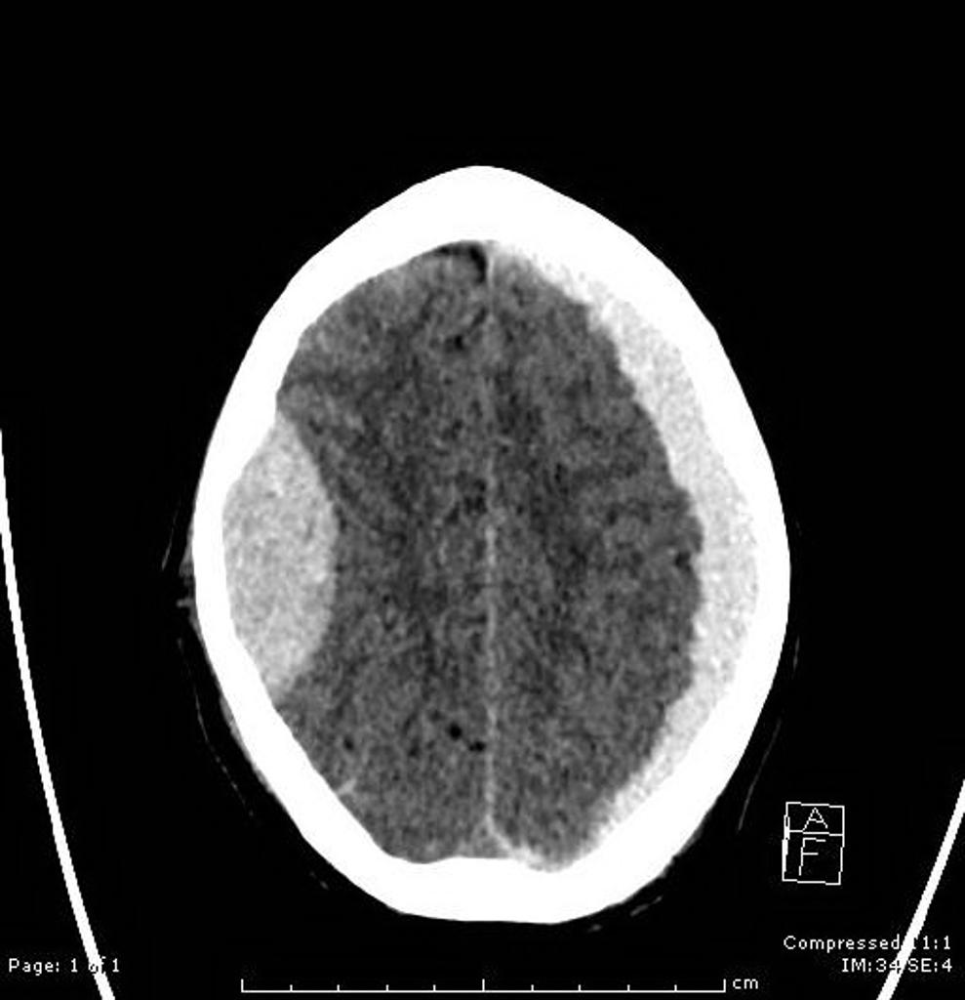

**Approval:** ________

---

### 1B. Subdural Hematoma — ANNOTATED with Arrows (separate image)
**Slide 9 (second image)** | Classic crescent SDH with arrows showing key findings
**Caption:** "Crescent-shaped hyperdensity crossing sutures — answer is subdural, not epidural"
**Source:** Wikimedia Commons | CC BY-SA

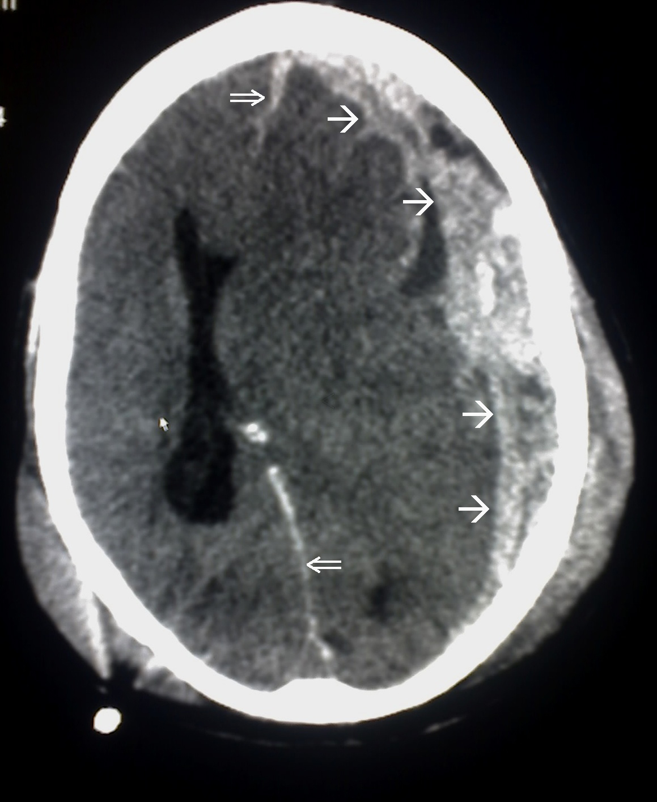

**Question:** Use alongside the Lemon vs Banana, or replace it?

**Approval:** ________

---

### 1C. Subdural with Herniation
**Slide 10 (alternative)** | SDH causing midline shift and herniation
**Caption:** "Subdural with midline shift — if pupil blown, answer is uncal herniation"
**Source:** Wikimedia Commons | Public Domain

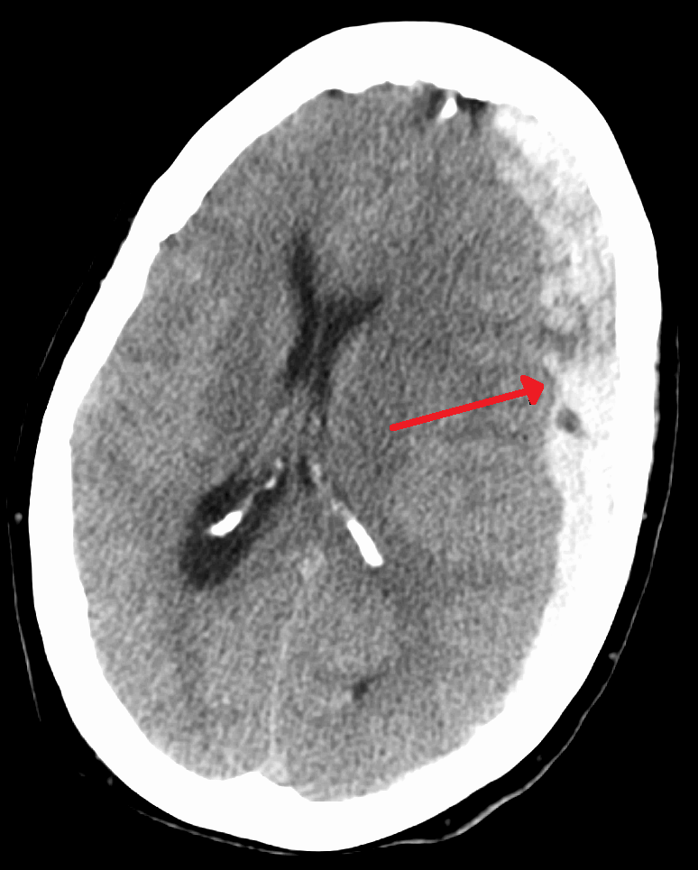

**Approval:** ________

---

### 1V. Herniation CT Scroll-Through (VIDEO)
**Slide 10 — Version B embed** | 206 axial slices, 17 seconds, scrub bar
**Caption:** "Watch midline shift develop — scrub to the key slice"
**File:** `images/ct_herniation_scroll.mp4` (2.5 MB)

> Open in QuickTime: `open images/ct_herniation_scroll.mp4`

**Approval:** ________

---

## Chest Trauma Section (Slides 26-30)

### 3. Tension Pneumothorax — Annotated CXR
**Slide 26 / MCQ Slide 29** | Annotated with colored highlights showing key signs
**Caption:** "Absent breath sounds + mediastinal shift + JVD — answer is needle decompression, not CXR"
**Source:** Radiopaedia rID-73040, Balint Botz | CC BY-NC-SA 3.0

**View 1: Initial CXR**
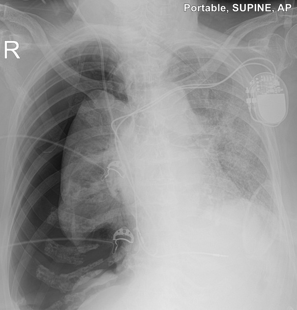

**View 2: Annotated with highlights**
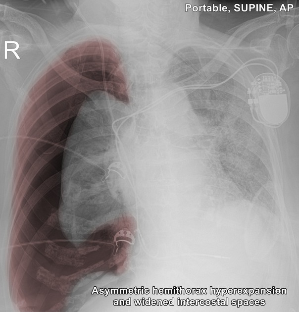

**View 3: Post chest tube**
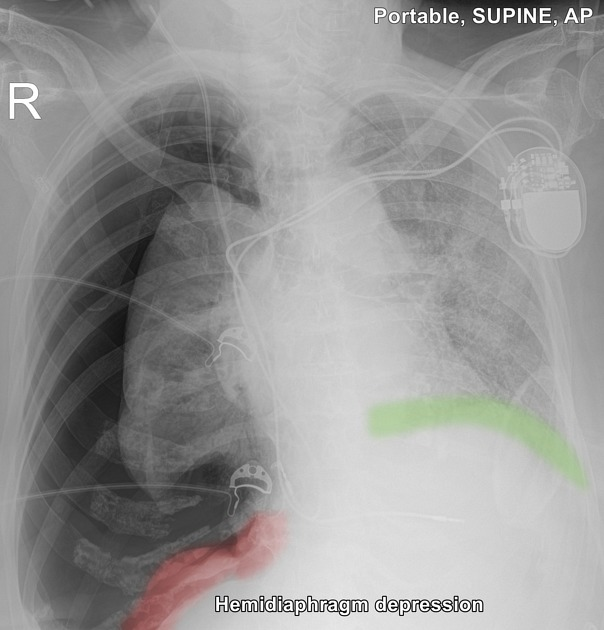

**Question:** Use all 3 views (pre/annotated/post) or just the annotated one?

**Approval:** ________

---

### 4. Hemothorax CXR (NEW — actual plain film, not CT)
**Slide 26** | Plain film CXR showing opacified hemithorax
**Caption:** "Chest tube drains >1500 mL — answer is thoracotomy, not observe"
**Source:** Radiopaedia | CC BY-NC-SA 3.0

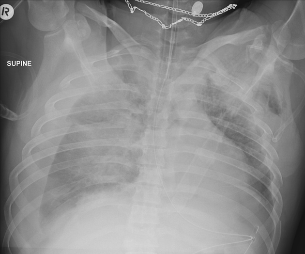

**Approval:** ________

---

### 4V. Hemothorax CT Scroll-Through (VIDEO)
**Slide 26 — Version B embed** | 191 axial slices, 16 seconds, scrub bar
**Caption:** "Watch hemothorax opacification develop — scrub to see rib fractures"
**File:** `images/ct_hemothorax_scroll.mp4` (4.6 MB)

> Open in QuickTime: `open images/ct_hemothorax_scroll.mp4`

**Approval:** ________

---

### 5. Widened Mediastinum CXR — Aortic Injury
**Slide 27** | CXR showing widened mediastinum
**Caption:** "Deceleration + mediastinum >8 cm — answer is CTA, not repeat CXR"
**Source:** Radiopaedia rID-200672, Craig Hacking Dec 2024 | CC BY-NC-SA 3.0

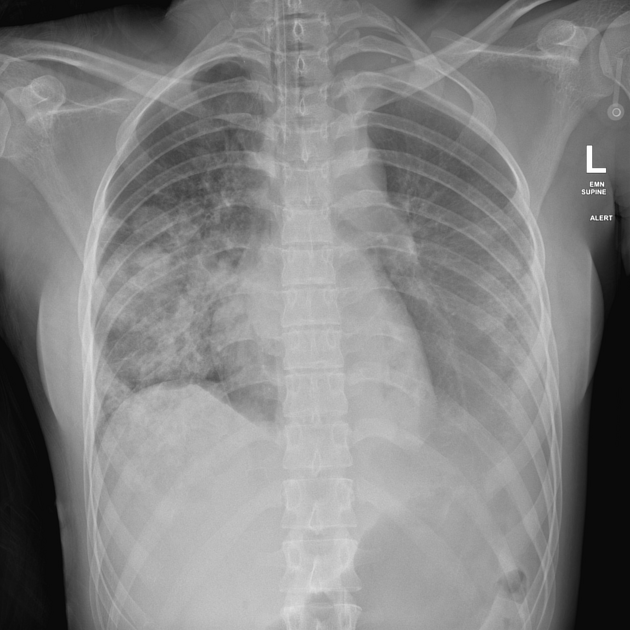

**Approval:** ________

---

## Abdominal Trauma Section (Slides 31-35)

### 6. FAST Exam — Morison's Pouch (LABELED)
**Slide 31 / MCQ Slide 34** | Labeled teaching image showing free fluid
**Caption:** "Positive FAST + unstable — answer is laparotomy, not CT"
**Source:** Wikimedia Commons | CC BY-SA

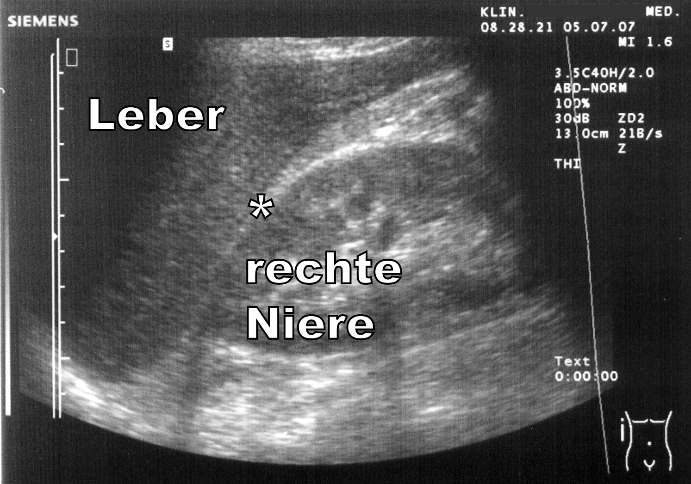

**Alternative: Raw clinical ultrasound (less labels, more realistic)**
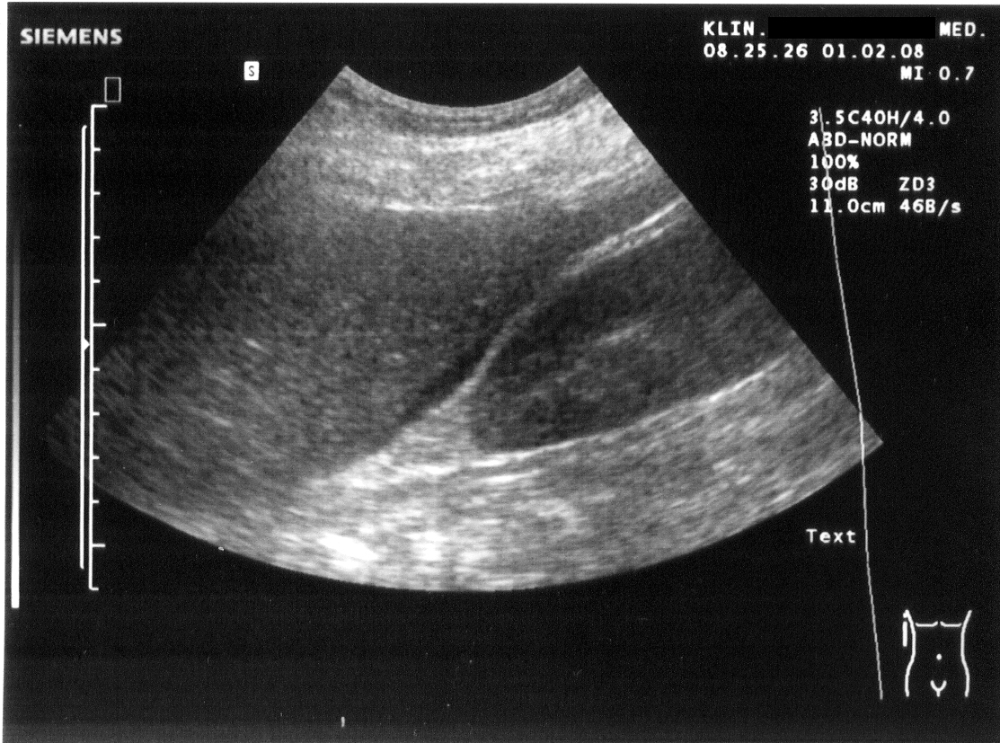

**Question:** Labeled version (top) or raw clinical version (bottom)?

**Approval:** ________

---

## Cardiac Tamponade (Slide 28)

### 7A. Pericardial Effusion — HD Clinical Image
**Slide 28** | 1920x1080 HD echocardiography showing pericardial effusion
**Caption:** "Beck triad + pericardial effusion — answer is pericardiocentesis, not needle decompression"
**Source:** Wikimedia Commons | CC BY-SA

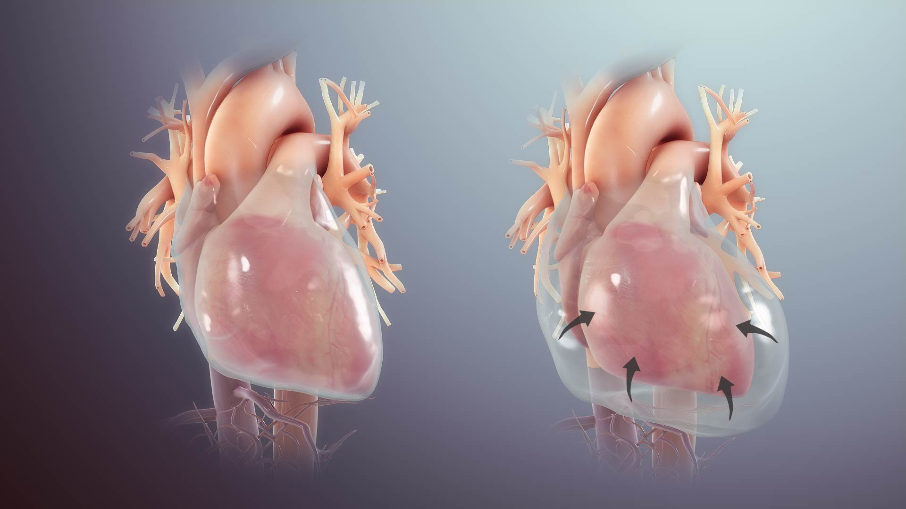

**Approval:** ________

---

### 7B. Cardiac Tamponade — Echo GIF with RV Collapse
**Slide 28 (animated)** | Echo loop showing tamponade physiology
**Caption:** "Watch RV diastolic collapse from pericardial pressure"
**Source:** Wikimedia Commons (PMC open access) | CC BY

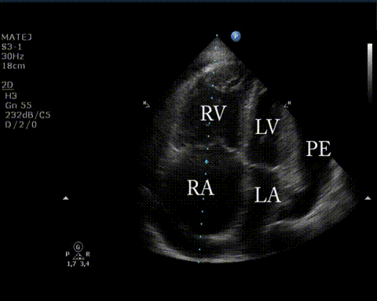

**Also available as MP4 (65 sec, scrub bar):** `images/08_echo_tamponade.mp4`

**Question:** Use the static HD image (7A), the animated echo GIF (7B), or both?

**Approval:** ________

---

## Pelvic Fractures (Slide 36)

### 8. Open Book Pelvic Fracture — ANNOTATED AP XR
**Slide 36** | Annotated AP pelvis showing pubic symphysis diastasis
**Caption:** "Unstable pelvis + positive FAST — answer is laparotomy, not angioembolization"
**Source:** Radiopaedia (annotated case) | CC BY-NC-SA 3.0

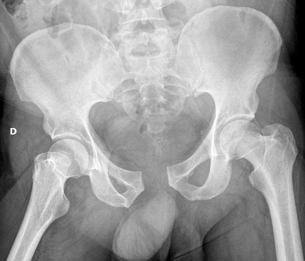

**Original (unannotated) for comparison:**
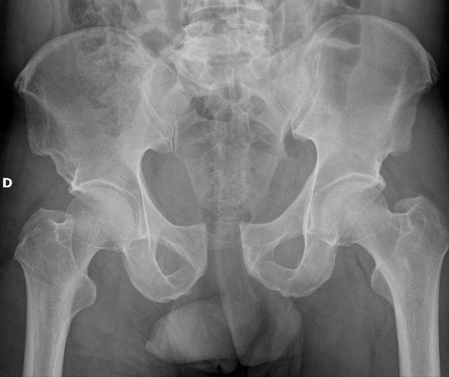

**Question:** Annotated (top) or original (bottom)?

**Approval:** ________

---

## Burns Section (Slides 20-25)

### 9. Burn Depth Classification Diagram
**Slide 20** | Cross-section showing skin layers and burn depth
**Caption:** "Painless, leathery wound — answer is full thickness, not deep partial"
**Source:** Wikimedia Commons | CC BY-SA 4.0

> SVG — open in browser: `open images/10_burn_degree_diagram.svg`

**Approval:** ________

---

### 10. Rule of Nines Diagram
**Slide 21** | Labeled body surface area percentages
**Caption:** "4 x kg x %TBSA, half by 8h from burn time — common error is from arrival"
**Source:** Wikimedia Commons, Jmarchn | CC BY-SA 3.0

> SVG — open in browser: `open images/11_rule_of_nines.svg`

**Approval:** ________

---

## Summary Table

| # | Slide | Image | File | Size | Annotated? | Status |
|---|-------|-------|------|------|-----------|--------|
| 1A | 9 | EDH vs SDH "Lemon vs Banana" | 01_edh_vs_sdh_lemon_banana.jpg | 63K | Both shown | ______ |
| 1B | 9 | Subdural with arrows | 02_subdural_ct_annotated.jpg | 475K | YES arrows | ______ |
| 1C | 10 | SDH + herniation | 02_sdh_subduralandherniation.png | 106K | Partial | ______ |
| 1V | 10 | Herniation CT scroll MP4 | ct_herniation_scroll.mp4 | 2.5M | Video | ______ |
| 3 | 26/29 | Tension PTX annotated | 04_tension_ptx_*.jpeg | 62-74K | YES colored | ______ |
| 4 | 26 | Hemothorax CXR (plain film) | 05_hemothorax_cxr_plain.jpeg | 77K | No | ______ |
| 4V | 26 | Hemothorax CT scroll MP4 | ct_hemothorax_scroll.mp4 | 4.6M | Video | ______ |
| 5 | 27 | Widened mediastinum CXR | 06_widened_mediastinum.jpeg | 270K | No | ______ |
| 6 | 31/34 | FAST Morison's labeled | 07_fast_morrisons_labeled.png | 1.7M | YES labeled | ______ |
| 7A | 28 | Pericardial effusion HD | 08_pericardial_effusion.jpg | 105K | No | ______ |
| 7B | 28 | Tamponade echo GIF | 08_echo_tamponade.gif | 643K | Animated | ______ |
| 8 | 36 | Pelvic open book annotated | 09_pelvic_annotated.jpeg | 96K | YES | ______ |
| 9 | 20 | Burns depth diagram | 10_burn_degree_diagram.svg | 463K | Labeled | ______ |
| 10 | 21 | Rule of nines | 11_rule_of_nines.svg | 181K | Labeled | ______ |
