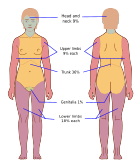

# Trauma for the Shelf: Every Topic in 45 Minutes
> **Template:** presentation-unified (45 slides)
> **Duration:** 45 minutes
> **Theme:** Marine (themeId: "marine", textMode: "preserve")
> **Audience:** MS3/MS4 pre-shelf exam review
> **Author:** Evan DeCan, MD | Division of Acute Care Surgery | University of Virginia
> **Date:** 2026-03-23

---

<!-- type: TITLE -->

## Trauma for the Shelf: Every Topic in 45 Minutes

Evan DeCan, MD
Division of Acute Care Surgery | University of Virginia
2026-03-23

**Gamma instruction: Full-bleed trauma bay hero image, white title 48pt centered, presenter name 24pt below, no bullets, dramatic cinematic lighting**

<!-- Speaker Notes:
Welcome everyone. This session covers every high-yield trauma topic tested on the NBME Surgery Shelf Exam in a single 45-minute review. Trauma and critical care account for 20-25% of the shelf -- roughly 22-28 of 110 questions -- making this the single highest-yield domain you can study. In fact, trauma quiz performance has the highest predictive beta-coefficient (1.57, p<0.001) for overall shelf scores across all surgical domains.

We will move through 10 domains: primary survey, hemorrhagic shock, TBI, spinal cord injury, burns, chest trauma, abdominal and neck trauma, pelvic and orthopedic emergencies, damage control surgery, and special populations. Each section ends with a shelf-style MCQ so you can test yourself in real time.

The single unifying principle across every trauma question on the shelf: stabilize before you scan. If a question offers CT as an answer choice in an unstable patient, that is the distractor. The answer is always resuscitation, decompression, or the operating room first. Let us begin.

> **Shelf Tip:** Trauma questions are distributed across NBME organ systems -- cardiovascular, respiratory, nervous, musculoskeletal, multisystem. There is no standalone "trauma" category, so recognize trauma patterns regardless of which system block you are in.
-->

---

<!-- type: LEARNING_OBJECTIVES -->

## Eight Objectives Across Ten Trauma Domains Cover the Entire Shelf

**Gamma instruction: Solid dark bg, numbered list 24pt, no images, 8 items max**

1. **Sequence** xABCDE — intervene before imaging
2. **Classify** shock I-IV — MTP by Shock Index
3. **Distinguish** epidural vs subdural by CT shape
4. **Identify** cord syndromes by deficit pattern
5. **Calculate** Parkland from burn time + Rule of Nines
6. **Differentiate** tension PTX vs tamponade at bedside
7. **Apply** FAST algorithms — blunt vs penetrating
8. **Recognize** DCS triggers + peds/geri/pregnancy mods

**Sources:**
- [1] American 2018
- [2] [Mott 2020](https://pubmed.ncbi.nlm.nih.gov/32389529/)

<!-- Speaker Notes:
These eight learning objectives map to the 10 domains we will cover today. Each objective uses a Bloom's taxonomy action verb because the shelf tests application, not recall. You will be asked to sequence a primary survey, classify shock, distinguish CT findings, identify cord syndrome patterns, calculate fluid volumes, differentiate clinical presentations, apply decision algorithms, and recognize when to modify management for special populations.

By the end of this session, you should be able to answer any trauma question on the shelf by applying one core framework: identify the life threat, intervene immediately, and only image when the patient is stable. Every domain we cover today reinforces that framework with specific decision rules and discriminators.

We will use 5 MCQ checkpoints to test your application of each section. Treat these like shelf questions -- commit to an answer before I reveal the explanation.

> **Shelf Tip:** The shelf tests clinical decision-making, not encyclopedic knowledge. For each topic, know the ONE discriminator that changes management -- that is what gets tested.
-->

---

<!-- type: DATA_TABLE -->

## The xABCDE Sequence Mandates Hemorrhage Control Before Airway Assessment

**Gamma instruction: Table dominates 70%, key row X highlighted in red accent, title = assertion, Bottom Line box**

| Step | Intervention |
|------|-------------|
| **X** | **Tourniquet, pressure, MTP** |
| **A** | Intubate if GCS ≤8 |
| **B** | Needle decompress |
| **C** | FAST, blood products |
| **D** | GCS + pupils |
| **E** | Log-roll, warm |

**[KEY STAT: Unstable + CT offered = CT is always wrong]**

> **Bottom Line:** Unstable patient offered CT -- answer is intervention first, not imaging


**Sources:**
- [1] American 2018
- [3] [StatPearls 2024](https://pubmed.ncbi.nlm.nih.gov/30480800/)

<!-- Speaker Notes:
The xABCDE sequence is the single most tested trauma concept on the shelf. The "x" stands for exsanguinating hemorrhage -- this is the MARCH-PAWS update to classic ATLS that prioritizes massive external bleeding control even before airway. On the shelf, this manifests as the patient with active hemorrhage where the "best next step" is direct pressure or tourniquet activation, not intubation.

Walk through each step: X is external hemorrhage control with direct pressure, tourniquets, or massive transfusion protocol activation. A is airway with C-spine protection -- intubate any patient with GCS 8 or below or inability to maintain the airway. B is breathing -- the six immediately life-threatening chest injuries (tension pneumothorax, open pneumothorax, massive hemothorax, flail chest, cardiac tamponade, airway obstruction) are ALL diagnosed clinically and treated before any imaging. C is circulation with two large-bore 14-16 gauge IVs and isotonic crystalloid, FAST exam, and blood product resuscitation. D is disability -- GCS, pupils, lateralizing signs. E is exposure with log-roll and hypothermia prevention.

The shelf trap is always the same: offering CT scan as an answer choice for an unstable patient. That is always wrong. Stabilize before you scan.

> **Shelf Tip:** If the patient has abnormal vitals and the stem offers "CT abdomen/pelvis" as an option, eliminate it immediately. The answer is resuscitation or OR.
-->

---

<!-- type: DATA_TABLE -->

## Class III-IV Hemorrhagic Shock Requires Blood Products, Not Crystalloid Alone

**Gamma instruction: Table dominates 70%, Class III-IV rows highlighted red accent, full ATLS data, Bottom Line box**

| | Class I | Class II | **Class III** | **Class IV** |
|---|---------|----------|-----------|----------|
| **Blood loss** | <15% | 15-30% | **30-40%** | **>40%** |
| **HR** | <100 | 100-120 | **>120** | **>140** |
| **BP** | Normal | Normal | **↓** | **↓↓** |
| **Rx** | Monitor | Crystalloid | **Blood** | **MTP 1:1:1** |

**[KEY STAT: BP doesn't drop until 30% lost — don't trust normal BP]**

> **Bottom Line:** HR 130, BP 80 -- answer is blood products, not 2L NS


**Sources:**
- [1] American 2018
- [4] [StatPearls 2024](https://pubmed.ncbi.nlm.nih.gov/29262047/)
- [5] [Holcomb 2015](https://pubmed.ncbi.nlm.nih.gov/25647203/)

<!-- Speaker Notes:
This table is among the most tested data sets on the surgery shelf. You must know the four classes of hemorrhagic shock cold. The key teaching point is that blood pressure does not fall until Class III -- meaning a patient can lose 30% of their blood volume (1500 mL) before the BP drops. Young, healthy patients are particularly dangerous because they compensate with tachycardia and vasoconstriction until they suddenly decompensate.

Class I is less than 15% blood loss -- these patients look almost normal with slight anxiety and heart rate under 100. They respond to crystalloid alone. Class II is 15-30% loss -- tachycardia to 100-120, still normal BP, mild anxiety. Class III is the critical inflection point: 30-40% loss, HR above 120, BP finally drops, the patient is confused, and they need blood products in addition to crystalloid. Class IV is exsanguination -- over 40% loss, HR above 140, obtunded, negligible urine output, and requires immediate massive transfusion with a 1:1:1 ratio.

The shelf question pattern is: patient arrives with tachycardia and hypotension after trauma. What is the next step? If vitals suggest Class III or IV, the answer is blood products -- never "2 liters of normal saline" as the final answer.

Base deficit and lactate are better markers of shock severity than vital signs alone. A normal lactate in a trauma patient is reassuring; a rising lactate despite crystalloid demands blood products.

> **Shelf Tip:** Memorize the Class III numbers as your trigger: HR >120 + BP decreased + confused = give blood, not just fluid.
-->

---

<!-- type: CONTENT -->

## Shock Index Greater Than 1.0 Triggers MTP and PROPPR 1:1:1 Saves Lives

**Gamma instruction: Dark bg, assertion title 28pt bold, 3 keyword bullets 20pt, ONE key stat 36pt accent, Bottom Line box**

- **SI >1.0** = hemorrhage; **>1.4** = MTP
- **1:1:1** pRBC:FFP:platelets (PROPPR)
- **ABC ≥2** activates MTP

**[KEY STAT: SI = HR ÷ SBP; >1.0 = 4x mortality]**

> **Bottom Line:** Shock Index >1.0 -- answer is MTP, not crystalloid


**Sources:**
- [5] [Holcomb 2015](https://pubmed.ncbi.nlm.nih.gov/25647203/)
- [6] [Mutschler 2013](https://pubmed.ncbi.nlm.nih.gov/23938104/)

<!-- Speaker Notes:
The Shock Index is heart rate divided by systolic blood pressure. A normal Shock Index is 0.5-0.7. When it exceeds 1.0, the patient has significant hemorrhage. When it exceeds 1.4, the patient almost certainly needs massive transfusion protocol activation.

The PROPPR trial (2015, PMID 25647203) randomized 680 patients predicted to require massive transfusion to either 1:1:1 (plasma:platelets:RBCs) or 1:1:2 ratios. The 1:1:1 group had significantly fewer deaths from exsanguination at 24 hours. This is the evidence behind the current standard of balanced resuscitation -- give blood products in equal ratios, minimize crystalloid.

The ABC score is a practical bedside tool for MTP activation: Penetrating mechanism (1 point), SBP 90 or below (1 point), HR 120 or above (1 point), positive FAST (1 point). A score of 2 or more triggers MTP activation.

The Lethal Triad -- hypothermia, acidosis, and coagulopathy -- is the rationale for damage control resuscitation. These three factors reinforce each other: hypothermia impairs clotting enzymes, acidosis impairs clotting factor function, and coagulopathy causes ongoing hemorrhage which worsens both hypothermia and acidosis. Breaking this cycle requires warm blood products in balanced ratios, not room-temperature crystalloid.

Permissive hypotension targets SBP 80-90 until surgical hemorrhage control -- but NOT in TBI patients, who need SBP above 90 to maintain cerebral perfusion.

> **Shelf Tip:** If a question describes a trauma patient with HR/SBP ratio >1 and asks "next step," the answer involves blood products and MTP activation, never "2L LR."
-->

---

<!-- type: CONTENT -->

## TXA Before Three Hours Saves Lives but After Three Hours Increases Mortality

**Gamma instruction: Dark bg, assertion title 28pt bold, 3 keyword bullets 20pt, ONE key stat 36pt accent, Bottom Line box**

- **<3 hours** = give TXA (1g bolus + 1g/8h)
- **>3 hours** = withhold (increases mortality)
- **CRASH-2:** n=20,211; 1.5% absolute reduction

**[KEY STAT: 3-hour cutoff — benefit before, harm after]**

> **Bottom Line:** 2h post-injury -- give TXA; 4h post -- withhold


**Sources:**
- [7] [CRASH-2 2010](https://pubmed.ncbi.nlm.nih.gov/20554319/)
- [8] [CRASH-2 2011](https://pubmed.ncbi.nlm.nih.gov/21439633/)

<!-- Speaker Notes:
The CRASH-2 trial (2010, PMID 20554319) is one of the most important trauma trials for the shelf. It randomized over 20,000 trauma patients with or at risk of significant bleeding to tranexamic acid (TXA) versus placebo. TXA reduced all-cause mortality by 1.5% absolute (14.5% vs 16.0%) when given within 3 hours of injury.

The critical shelf point is the time-dependent effect. When given within 1 hour, the benefit is greatest. Within 1-3 hours, there is still benefit but less. After 3 hours, TXA actually INCREASES the risk of death from bleeding. This is not just "no benefit" -- it is active harm. The mechanism is thought to be related to TXA's effect on established clot -- late administration may disrupt organized thrombus.

The dosing is straightforward: 1 gram IV bolus over 10 minutes, followed by 1 gram infused over 8 hours. This should be initiated as early as possible, ideally in the prehospital setting or immediately on arrival.

On the shelf, this shows up as a time-stamped scenario. The stem will tell you when the injury occurred and when the patient arrives. If fewer than 3 hours have passed from injury, TXA is correct. If more than 3 hours, TXA is wrong even if the patient is actively bleeding.

The MATTERs trial (military data) and CRASH-3 (TBI-specific) further support early TXA use, though CRASH-3 showed benefit primarily in mild-to-moderate TBI (GCS 9-15), not severe TBI.

> **Shelf Tip:** Always check the timeline in the question stem. TXA questions are testing whether you know the 3-hour window, not whether you know TXA exists.
-->

---

<!-- type: MCQ -->

## Clinical Decision Point

**Gamma instruction: Question 24pt, options A-D clean list, no answer shown, interactive feel, blue accent**

**A 32-year-old male arrives after a GSW to the left chest and abdomen. HR 140, BP 70/40, RR 32, SpO2 88%, GCS 7. There is active hemorrhage from the abdominal wound and no breath sounds on the left. What is the most appropriate FIRST step?**

- A. Endotracheal intubation (GCS 7 requires definitive airway)
- B. Direct pressure to abdominal wound + activate MTP
- C. Left needle decompression (absent breath sounds)
- D. CT chest/abdomen/pelvis with IV contrast

<!-- Speaker Notes:
Pause here. This question tests the xABCDE sequence in a multiply-injured patient. Take 30 seconds to commit to your answer. Consider: what is the most immediate life threat? The patient has active external hemorrhage (X), a compromised airway (GCS 7 meets intubation criteria for A), absent breath sounds suggesting tension pneumothorax (B), and shock (C). Which letter comes first?

The key teaching point is that X comes before A in the updated sequence. Even though GCS 7 mandates intubation, active exsanguinating hemorrhage must be controlled first. The patient will die from bleeding faster than from the unprotected airway.

> **Shelf Tip:** When multiple life threats coexist, follow the alphabetical sequence. X before A before B before C. Do not skip ahead.
-->

---

<!-- type: MCQ_ANSWER -->

## Answer: B -- Control Hemorrhage First Because X Precedes A in xABCDE

**Gamma instruction: Dark bg, correct answer B highlighted in green accent, brief explanation with evidence**

- **Why B:** Active hemorrhage = X step, first priority
- **Why not A:** GCS ≤8 = intubate, but X before A
- **Why not C:** Absent BS = B step, follows X and A
- **Why not D:** CT in unstable = never correct

**[KEY STAT: Tourniquet 15 sec; RSI 3-5 min]**

> **Bottom Line:** Exsanguinating hemorrhage (X) -- address before airway (A)


**Sources:**
- [1] American 2018
- [3] [StatPearls 2024](https://pubmed.ncbi.nlm.nih.gov/30480800/)

<!-- Speaker Notes:
The correct answer is B. This patient has exsanguinating external hemorrhage, which is the X step -- the very first priority in the updated xABCDE sequence. Direct pressure to the abdominal wound and immediate activation of massive transfusion protocol addresses the most immediately lethal problem.

Answer A (intubation) is the second priority. Yes, GCS 7 absolutely requires a definitive airway, but the patient will exsanguinate before hypoxia from an unprotected airway kills them. Once hemorrhage is controlled, intubation becomes the next step.

Answer C (needle decompression) addresses the absent breath sounds, which likely represents either hemothorax or tension pneumothorax. This is a B-step intervention. While it is critical, it follows hemorrhage control and airway in the sequence.

Answer D (CT scan) is the classic shelf distractor. This patient has a systolic BP of 70, tachycardia to 140, and is actively bleeding. A CT scan will not change management and delays definitive treatment. This patient needs the operating room, not the CT scanner. Never select CT for a hemodynamically unstable trauma patient.

The teaching pearl: when multiple life threats coexist, the xABCDE sequence tells you the priority order. X always comes first. This question is designed to tempt you with intubation (which feels urgent given GCS 7) but the correct framework is sequential.

> **Shelf Tip:** The shelf loves questions with competing priorities. When in doubt, follow the alphabet: X, A, B, C, D, E. The earliest letter is always the first step.
-->

---

<!-- type: DATA_TABLE -->

## Biconvex CT Means Epidural; Crescent Means Subdural -- Distinct Populations and Prognosis

**Gamma instruction: Table dominates 70%, key diagnostic rows highlighted accent, title = assertion, Bottom Line box**


| Feature | Epidural | Subdural |
|---------|----------|----------|
| **Source** | MMA | Bridging veins |
| **CT** | **Biconvex** | **Crescent** |
| **History** | Lucid interval | Gradual decline |
| **Population** | Young, temporal fx | Elderly, anticoag |
| **OR threshold** | >1cm / >30mL / shift | >10mm / >5mm shift |

**[KEY STAT: Biconvex + lucid interval = epidural]**

> **Bottom Line:** Biconvex on CT -- answer is epidural, not subdural


**Sources:**
- [9] [Bullock 2006](https://pubmed.ncbi.nlm.nih.gov/16710967/)
- [10] [Bullock 2006](https://pubmed.ncbi.nlm.nih.gov/16710968/)

<!-- Speaker Notes:
Epidural versus subdural hematoma is one of the most tested comparisons on the surgery shelf. You must distinguish them by CT morphology, clinical history, population, and management.

Epidural hematomas arise from the middle meningeal artery, usually from a temporal bone fracture. The blood collects between the dura and the skull, creating a biconvex or lens-shaped hyperdensity on CT. The classic presentation is the lucid interval: a patient sustains a temporal blow, may briefly lose consciousness, then has a lucid period of normal function, followed by rapid neurological deterioration as the arterial bleed expands. This is typically a young patient because the dura is more tightly adherent to the skull in elderly patients.

Subdural hematomas arise from torn bridging veins between the cortex and dural sinuses. They appear as crescent-shaped collections that spread over the cerebral convexity. They are most common in elderly patients, those on anticoagulants, alcoholics, and anyone with brain atrophy (which stretches the bridging veins). Acute subdurals carry a devastating 40-60% mortality rate.

The surgical thresholds differ: EDH is evacuated if greater than 1 cm thickness, greater than 30 mL volume, or if there is midline shift. SDH is evacuated if greater than 10 mm thickness or greater than 5 mm midline shift.

The shelf will give you a CT description and ask you to identify the lesion and next step. Biconvex equals epidural. Crescent equals subdural. Learn these shapes and you will never miss this question.

> **Shelf Tip:** The word "biconvex" or "lens-shaped" on a CT description always means epidural. "Crescent" or "concavo-convex" always means subdural. These are reliable discriminators.
-->

---

<!-- type: CONTENT -->

## Uncal Herniation Produces Ipsilateral Blown Pupil While Cushing Triad Signals Imminent Death

**Gamma instruction: Dark bg, assertion title 28pt bold, 3 keyword bullets 20pt, ONE key stat 36pt accent, Bottom Line box**


- **Uncal** — CN III → ipsilateral blown pupil
- **Central** — bilateral fixed, decerebrate
- **Cushing triad** — HTN + brady + irregular resp

**[KEY STAT: Cushing triad = minutes to act]**

> **Bottom Line:** Ipsilateral fixed dilated pupil -- answer is uncal herniation, not central


**Sources:**
- [9] [Bullock 2006](https://pubmed.ncbi.nlm.nih.gov/16710967/)
- [10] [Bullock 2006](https://pubmed.ncbi.nlm.nih.gov/16710968/)
- [11] [Carney 2017](https://pubmed.ncbi.nlm.nih.gov/27654000/)

<!-- Speaker Notes:
Herniation syndromes are tested because they demand immediate recognition and intervention. The shelf will present a deteriorating TBI patient and ask you to identify the herniation pattern.

Uncal herniation is the most common and most tested. The temporal lobe herniates through the tentorial notch, compressing the ipsilateral CN III (oculomotor nerve). This produces a fixed, dilated pupil on the SAME side as the lesion. As herniation progresses, the cerebral peduncle is compressed, causing contralateral hemiparesis. The classic presentation is: patient with known head injury develops unilateral blown pupil followed by contralateral weakness. This is a neurosurgical emergency requiring immediate decompression.

Central herniation involves bilateral downward displacement of the brain through the tentorial notch. Both pupils become small then fixed. The patient progresses from decorticate posturing (flexion) to decerebrate posturing (extension), indicating progressively deeper brainstem dysfunction.

The Cushing triad -- hypertension, bradycardia, and irregular respirations -- is a late sign of brainstem compression from rising ICP. This is a pre-terminal finding. If you see Cushing triad on the shelf, the patient needs emergent intervention. The hypertension is the body's attempt to maintain cerebral perfusion against rising ICP (Cushing reflex), while the bradycardia is a vagal response to the hypertension.

Do not confuse herniation with the Monroe-Kellie doctrine, which explains WHY herniation occurs: the skull is a fixed box containing brain, blood, and CSF. Any volume increase in one component must be compensated by decrease in another, or ICP rises exponentially.

> **Shelf Tip:** "Fixed dilated pupil" on the shelf = uncal herniation. "Bilateral fixed pupils" = central herniation. "HTN + bradycardia" = Cushing triad. These are pattern-matched discriminators.
-->

---

<!-- type: DATA_TABLE -->

## BTF Guidelines Tier ICP Management From Conservative to Craniectomy

**Gamma instruction: Table dominates 70%, Tier 3 row highlighted red accent, progressive escalation, Bottom Line box**

| Tier | Interventions | Target |
|------|--------------|--------|
| **1** | HOB 30°, sedation, CSF drain | ICP <22 |
| **2** | HTS 23.4% / mannitol | CPP 60-70 |
| **3** | Craniectomy, barb coma | Refractory |

**[KEY STAT: ICP threshold <22 (BTF 4th Ed)]**

> **Bottom Line:** Refractory ICP despite osmotherapy -- answer is craniectomy, not more mannitol


**Sources:**
- [11] [Carney 2017](https://pubmed.ncbi.nlm.nih.gov/27654000/)
- [12] Brain 2016

<!-- Speaker Notes:
The Brain Trauma Foundation 4th Edition guidelines (2016) provide a tiered approach to ICP management that is commonly tested on the shelf. The key change from prior editions is the ICP threshold: it is now 22 mmHg, not 20.

Tier 1 interventions are conservative: elevate the head of bed to 30 degrees to promote venous drainage, maintain sedation and analgesia, target normocapnia with PaCO2 between 35-40 mmHg, maintain normothermia, and drain CSF through an external ventricular drain if one is in place. These are first-line and should be initiated immediately.

Tier 2 escalates to osmotherapy. Hypertonic saline (23.4% via central line, or 3% as boluses) and mannitol (0.25-1 g/kg IV) both draw water out of brain tissue via osmotic gradients. Mild hyperventilation (PaCO2 30-35) causes cerebral vasoconstriction and reduces cerebral blood volume, but this is only a BRIDGE -- sustained hyperventilation causes ischemia.

Tier 3 is for refractory ICP: decompressive craniectomy (removing a portion of the skull to allow the swollen brain to expand) or pentobarbital coma (which drastically reduces cerebral metabolic demand). The DECRA and RESCUEicp trials showed craniectomy reduces ICP and mortality but may increase rates of vegetative state.

The CPP target of 60-70 mmHg is calculated as MAP minus ICP. This is why hypotension is so deadly in TBI -- low MAP directly reduces CPP.

> **Shelf Tip:** The shelf loves to present "refractory ICP despite mannitol." The next step is Tier 3 -- craniectomy or barbiturate coma. "More mannitol" is never the answer for refractory elevation.
-->

---

<!-- type: CONTENT -->

## Hypotension Doubles TBI Mortality Because Monroe-Kellie Demands Adequate MAP

**Gamma instruction: Dark bg, assertion title 28pt bold, 3 keyword bullets 20pt, ONE key stat 36pt accent, Bottom Line box**

- **SBP <90** → doubles TBI mortality
- **SpO2 <90** → independently worsens outcome
- **Monroe-Kellie** — fixed box: brain + blood + CSF
- **No routine hyperventilation** — bridge only

**[KEY STAT: Single SBP <90 episode = 2x mortality]**

> **Bottom Line:** TBI + BP 85/50 -- answer is raise MAP, not hyperventilate


**Sources:**
- [9] [Bullock 2006](https://pubmed.ncbi.nlm.nih.gov/16710967/)
- [11] [Carney 2017](https://pubmed.ncbi.nlm.nih.gov/27654000/)
- [12] Brain 2016

<!-- Speaker Notes:
Secondary brain injury prevention is one of the shelf's favorite TBI topics because it tests whether you understand the physiology, not just the interventions. The two key insults are hypotension (SBP below 90) and hypoxia (SpO2 below 90), and both independently worsen TBI outcomes.

Hypotension doubles TBI mortality. This is not an exaggeration -- it is a robust finding across multiple large studies. The mechanism is straightforward: cerebral perfusion pressure equals MAP minus ICP. If MAP drops (due to hypotension), CPP drops, and the already-injured brain suffers ischemia on top of the primary mechanical injury. This is why permissive hypotension, which is standard in hemorrhagic shock, is CONTRAINDICATED in TBI. TBI patients need SBP above 90 -- ideally above 110.

The Monroe-Kellie doctrine explains why ICP management is so challenging. The skull is a rigid box with three components: brain parenchyma (80%), blood (10%), and CSF (10%). Since the total volume is fixed, any increase in one component (e.g., a hematoma adding volume) must be compensated by displacement of another (CSF shifts to the spinal canal, venous blood is displaced). Once compensatory mechanisms are exhausted, even tiny additional volume increases cause exponential ICP rises.

Hyperventilation is a common wrong answer on the shelf. While lowering PaCO2 does reduce ICP by causing cerebral vasoconstriction, it also reduces cerebral blood flow, potentially worsening ischemia. It should only be used as an emergency bridge during active herniation while preparing for definitive intervention.

> **Shelf Tip:** "TBI patient with hypotension -- next step?" Answer is volume resuscitation and vasopressors to raise MAP. Never "hyperventilate" as the primary treatment for TBI.
-->

---

<!-- type: MCQ -->

## Clinical Decision Point

**Gamma instruction: Question 24pt, options A-D clean list, no answer shown, interactive feel, blue accent**

**A 28-year-old male presents after an assault with a baseball bat to the right temple. Initial GCS was 15. In the ED, he becomes increasingly lethargic (GCS 10), then unresponsive (GCS 6) with a fixed, dilated right pupil. CT shows a biconvex hyperdensity at the right temporal region with 8 mm midline shift. What is the most appropriate next step?**

- A. Administer 23.4% hypertonic saline and repeat CT in 1 hour
- B. Elevate head of bed, sedate, and monitor ICP with EVD
- C. Emergent craniotomy for hematoma evacuation
- D. Hyperventilate to PaCO2 25 mmHg and consult neurosurgery

<!-- Speaker Notes:
This is a classic epidural hematoma presentation. Commit to your answer. The patient has the complete triad: temporal trauma, lucid interval (initial GCS 15 that deteriorated), and a biconvex CT finding with midline shift. Additionally, the ipsilateral fixed dilated pupil indicates uncal herniation is occurring NOW.

Consider each option: Is there time for conservative management? What does the midline shift tell you? What does the blown pupil tell you about urgency?

> **Shelf Tip:** When a question gives you CT morphology + midline shift + neurological decline, the management decision is already made. Know the surgical thresholds.
-->

---

<!-- type: MCQ_ANSWER -->

## Answer: C -- Biconvex Hematoma With Shift and Herniation Requires Emergent Craniotomy

**Gamma instruction: Dark bg, correct answer C highlighted in green accent, brief explanation with evidence**

- **Why C:** Biconvex + shift + blown pupil = OR now
- **Why not A:** HTS is bridge, not definitive for surgical lesion
- **Why not B:** EVD for diffuse injury, not surgical mass
- **Why not D:** PaCO2 25 causes ischemia; bridge only

**[KEY STAT: EDH prognosis good if evacuated early]**

> **Bottom Line:** Epidural + midline shift + blown pupil = emergent craniotomy


**Sources:**
- [9] [Bullock 2006](https://pubmed.ncbi.nlm.nih.gov/16710967/)
- [10] [Bullock 2006](https://pubmed.ncbi.nlm.nih.gov/16710968/)
- [11] [Carney 2017](https://pubmed.ncbi.nlm.nih.gov/27654000/)

<!-- Speaker Notes:
The correct answer is C -- emergent craniotomy. This patient has a textbook epidural hematoma presentation: temporal blow, lucid interval, rapid decline, biconvex hyperdensity on CT, 8 mm midline shift, and an ipsilateral fixed dilated pupil indicating uncal herniation.

The surgical threshold for epidural hematoma is any of: greater than 1 cm thickness, greater than 30 mL volume, or midline shift. This patient has 8 mm of midline shift plus clinical herniation signs. There is no role for watchful waiting or conservative ICP management here. This patient needs the OR immediately.

Answer A (hypertonic saline) is a Tier 2 ICP intervention. While it may temporarily reduce ICP, it delays the definitive treatment -- surgical evacuation. Osmotherapy is for patients with elevated ICP who do NOT have a surgical mass lesion requiring immediate evacuation.

Answer B (EVD and monitoring) is Tier 1 management appropriate for diffuse injury or post-operative monitoring. This patient has a surgical lesion causing herniation. Monitoring ICP without removing the cause is inappropriate.

Answer D (hyperventilation to PaCO2 25) is dangerous. While hyperventilation reduces ICP by causing cerebral vasoconstriction, targeting PaCO2 of 25 is far below the recommended range (30-35 for brief bridge) and causes significant cerebral ischemia. Even as a bridge, it should only target PaCO2 30-35, and only while actively preparing for surgery.

The prognosis for epidural hematoma with early evacuation is good -- this is one of the few neurosurgical emergencies where rapid intervention can be truly life-saving.

> **Shelf Tip:** Epidural hematoma is the "good" emergency -- early surgery produces excellent outcomes. This is why rapid identification matters. Biconvex + shift = OR, always.
-->

---

<!-- type: DATA_TABLE -->

## Four Spinal Cord Syndromes Have Distinct Motor-Sensory Patterns That Predict Recovery

**Gamma instruction: Table dominates 70%, key diagnostic patterns highlighted accent, title = assertion, Bottom Line box**

| Syndrome | Mechanism | Lost | Preserved |
|----------|-----------|------|-----------|
| **Anterior** | Burst fx / aortic | Motor, pain, temp | Proprio, vibration |
| **Central** | Hyperextension (elderly) | Arms >> legs | Sacral sensation |
| **Brown-Sequard** | Hemisection (penetrating) | Ipsi motor; contra pain | Opposite modalities |
| **Cauda equina** | L1-L2 compression | Saddle, bowel/bladder | **Surgical emergency** |

**[KEY STAT: Central cord = most common incomplete SCI]**

> **Bottom Line:** Arms worse than legs in elderly -- answer is central cord, not anterior


**Sources:**
- [13] [Hoffman 2000](https://pubmed.ncbi.nlm.nih.gov/10891516/)
- [14] [Stiell 2001](https://pubmed.ncbi.nlm.nih.gov/11597285/)

<!-- Speaker Notes:
The four spinal cord syndromes are a favorite shelf topic because each has a distinct mechanism, deficit pattern, and prognosis. You must be able to identify each syndrome from a clinical vignette.

Anterior cord syndrome results from injury to the anterior two-thirds of the spinal cord, usually from a burst fracture or aortic injury (anterior spinal artery occlusion). The anterior columns carry motor function and the spinothalamic tracts (pain and temperature). The posterior columns (proprioception and vibration) are spared because they have a separate blood supply from the posterior spinal arteries. Prognosis is poor -- only about 10-20% recover functional motor ability.

Central cord syndrome is the most commonly tested because it is the most common incomplete spinal cord injury. It occurs in elderly patients with preexisting cervical stenosis who sustain a hyperextension injury (often a fall). The central part of the cord, which carries the upper extremity tracts, is preferentially injured. This produces the characteristic "arms worse than legs" pattern with cape-like distribution. Sacral sensation is typically spared. This has the best prognosis of all cord syndromes, and many patients regain ambulatory function.

Brown-Sequard syndrome results from hemisection of the cord, classically from penetrating trauma. The pattern is ipsilateral motor loss and proprioception loss (corticospinal and dorsal column tracts) with contralateral pain and temperature loss (spinothalamic tract crosses at the anterior commissure). This has a relatively good prognosis.

Cauda equina syndrome involves compression of the nerve roots below the conus medullaris. It produces saddle anesthesia, bowel and bladder dysfunction, and lower motor neuron signs. This is a surgical emergency requiring urgent decompression.

> **Shelf Tip:** The discriminator for the shelf: "arms worse than legs in elderly after fall" = central cord. "Loss of pain/temp with preserved proprioception" = anterior cord. "Ipsilateral motor + contralateral pain/temp loss" = Brown-Sequard.
-->

---

<!-- type: DATA_TABLE -->

## Canadian C-Spine Rule Is More Specific Than NEXUS for Clearing the Cervical Spine

**Gamma instruction: Table dominates 70%, specificity difference highlighted accent, title = assertion, Bottom Line box**

| Feature | NEXUS | CCR |
|---------|-------|-----|
| **Sensitivity** | 99.6% | 99.4-100% |
| **Specificity** | 12.9% | **45.1%** |
| **Criteria** | 5 low-risk | 3-step algorithm |
| **Obtunded** | CT alone (NPV >99%) | CT alone (NPV >99%) |

**[KEY STAT: CCR 3.5x more specific — fewer unnecessary CTs]**

> **Bottom Line:** Alert stable trauma -- answer is apply CCR, not automatic CT


**Sources:**
- [13] [Hoffman 2000](https://pubmed.ncbi.nlm.nih.gov/10891516/)
- [14] [Stiell 2001](https://pubmed.ncbi.nlm.nih.gov/11597285/)
- [15] [Ryken 2013](https://pubmed.ncbi.nlm.nih.gov/23417179/)

<!-- Speaker Notes:
C-spine clearance decision rules are tested because the shelf wants you to avoid unnecessary imaging while not missing cervical spine injuries. Both NEXUS and the Canadian C-Spine Rule have near-perfect sensitivity, but they differ significantly in specificity.

NEXUS uses five low-risk criteria: no posterior midline cervical tenderness, no intoxication, normal alertness (GCS 15), no focal neurologic deficit, and no painful distracting injury. If ALL five are met, the c-spine can be cleared clinically without imaging. The problem with NEXUS is its low specificity (12.9%) -- meaning it still sends a lot of patients for unnecessary CTs.

The Canadian C-Spine Rule uses a three-step algorithm. Step 1: any high-risk factor mandating imaging? (age over 65, dangerous mechanism, paresthesias). Step 2: any low-risk factor allowing safe range-of-motion testing? (simple rear-end MVC, sitting position in ED, ambulatory, delayed onset neck pain, no midline tenderness). Step 3: can the patient actively rotate their neck 45 degrees left and right? If yes, no imaging needed. The CCR is 3.5 times more specific than NEXUS, meaning it sends far fewer patients for unnecessary imaging.

The CCR is preferred when applicable -- the patient must be alert, hemodynamically stable, and 16 years or older. For obtunded patients who cannot participate in clinical clearance, a high-quality CT scan alone is sufficient according to EAST guidelines (negative predictive value greater than 99%).

The shelf question pattern is typically: alert, stable trauma patient with neck pain. What is the next step? The answer is usually "apply clinical decision rule" rather than "CT c-spine."

> **Shelf Tip:** If the stem describes an alert, stable trauma patient, the answer is "clinical clearance with CCR" not "CT c-spine." Reserve CT for patients who fail clinical clearance or cannot be assessed.
-->

---

<!-- type: CONTENT -->

## Neurogenic Shock Produces Bradycardia Plus Hypotension -- Norepinephrine Is First-Line

**Gamma instruction: Dark bg, assertion title 28pt bold, 3 keyword bullets 20pt, ONE key stat 36pt accent, Bottom Line box**

- **Triad:** hypotension + bradycardia + warm
- **Mechanism:** loss of sympathetic tone above T6
- **Rx:** norepinephrine first-line, MAP >85 x 7d

**[KEY STAT: Brady = neurogenic; tachy = hemorrhagic]**

> **Bottom Line:** Hypotension + bradycardia + warm -- answer is neurogenic, not hypovolemic


**Sources:**
- [13] [Hoffman 2000](https://pubmed.ncbi.nlm.nih.gov/10891516/)
- [14] [Stiell 2001](https://pubmed.ncbi.nlm.nih.gov/11597285/)

<!-- Speaker Notes:
Neurogenic shock is one of the most tested shock subtypes on the shelf because it requires pattern recognition to distinguish from hemorrhagic shock. Both present with hypotension, but the heart rate and skin findings are the discriminators.

In hemorrhagic shock, the sympathetic nervous system is intact and responds to blood loss with tachycardia, vasoconstriction, and cool/clammy extremities. In neurogenic shock, the sympathetic chain is disrupted (usually from cervical or high thoracic spinal cord injury above T6), resulting in unopposed parasympathetic (vagal) tone. This produces the classic triad: hypotension (from loss of vascular tone), bradycardia (from unopposed vagal activity), and warm, flushed, vasodilated extremities.

The treatment is vasopressors, with norepinephrine as the first-line agent (it provides both alpha-mediated vasoconstriction and beta-mediated chronotropy). The target is MAP above 85 mmHg maintained for 7 days to optimize spinal cord perfusion. Atropine may be needed for symptomatic bradycardia. Importantly, you must first rule out hemorrhagic shock -- a spinal cord injury patient can have BOTH neurogenic and hemorrhagic shock simultaneously.

Do not confuse neurogenic shock (a cardiovascular emergency) with spinal shock (a neurological phenomenon). Spinal shock is the transient loss of spinal cord function and reflexes below the level of injury. It resolves when the bulbocavernosus reflex returns. Neurogenic shock can last days to weeks and requires active hemodynamic management.

Steroids for spinal cord injury (the NASCIS II/III legacy) are NOT recommended by current AANS/CNS guidelines. If a question asks about methylprednisolone for acute SCI, the current evidence-based answer is "do not give."

> **Shelf Tip:** The single discriminator: hemorrhagic shock = tachycardia + cold. Neurogenic shock = bradycardia + warm. If the stem gives you hypotension with a slow heart rate after spinal trauma, the answer is neurogenic shock and norepinephrine.
-->

---

<!-- type: MCQ -->

## Clinical Decision Point

**Gamma instruction: Question 24pt, options A-D clean list, no answer shown, interactive feel, blue accent**

**A 22-year-old female presents after a diving accident with a C5 burst fracture. She has no motor function below C5. BP 78/50, HR 52, extremities are warm and flushed. 1L LR has been given with no improvement. What is the most appropriate next step?**

- A. Transfuse 2 units pRBC (hemorrhagic shock)
- B. Start norepinephrine infusion
- C. High-dose methylprednisolone (NASCIS protocol)
- D. Emergent MRI of cervical spine

<!-- Speaker Notes:
This question presents the classic neurogenic shock triad: hypotension, bradycardia, and warm extremities in the setting of a cervical spinal cord injury. The patient has failed an initial crystalloid bolus. Consider what the heart rate tells you about the type of shock and what that means for treatment.

> **Shelf Tip:** Heart rate is the key discriminator between shock types in the trauma setting. Tachycardia = volume loss. Bradycardia with spinal injury = neurogenic.
-->

---

<!-- type: MCQ_ANSWER -->

## Answer: B -- Bradycardia Distinguishes Neurogenic From Hemorrhagic Shock

**Gamma instruction: Dark bg, correct answer B highlighted in green accent, brief explanation with evidence**

- **Why B:** NE = alpha-1 + beta-1 (vasoconstriction + chronotropy)
- **Why not A:** Phenylephrine = pure alpha, worsens brady
- **Why not C:** NASCIS steroids NOT recommended (AANS/CNS)
- **Why not D:** Stabilize before imaging

**[KEY STAT: NE addresses both vasodilation and bradycardia]**

> **Bottom Line:** Spinal injury + bradycardia + hypotension = neurogenic shock; give norepinephrine


**Sources:**
- [13] [Hoffman 2000](https://pubmed.ncbi.nlm.nih.gov/10891516/)
- [14] [Stiell 2001](https://pubmed.ncbi.nlm.nih.gov/11597285/)

<!-- Speaker Notes:
The correct answer is B -- norepinephrine infusion. This patient has the complete neurogenic shock triad: hypotension (BP 78/50), bradycardia (HR 52), and warm vasodilated extremities, all in the setting of a cervical spinal cord injury at C5. The C5 level is above T6, meaning the entire thoracolumbar sympathetic chain is disrupted.

The bradycardia is the key discriminator. In hemorrhagic shock, you would expect compensatory tachycardia (HR above 100). A heart rate of 52 in a hypotensive trauma patient strongly suggests loss of sympathetic tone rather than volume depletion, especially with the warm extremities (vasodilation rather than the vasoconstriction seen in hemorrhagic shock).

Answer A (blood products) would be appropriate if this were hemorrhagic shock, but the hemodynamic profile points away from volume loss. That said, in clinical practice, you would want to rule out concurrent hemorrhage -- a spinal cord injury patient can bleed from other injuries simultaneously.

Answer C (NASCIS protocol methylprednisolone) is a historical answer that is no longer supported. The AANS/CNS issued guidelines recommending AGAINST routine steroid use in acute SCI. The NASCIS II and III trials had significant methodological flaws, and the risk-benefit ratio does not favor steroids.

Answer D (MRI) is important for surgical planning but does not address the immediate hemodynamic emergency. Stabilize first, image later.

Norepinephrine is first-line because it provides both alpha-1 vasoconstriction (to counteract the loss of sympathetic vascular tone) and beta-1 effects (to increase heart rate). The MAP target is above 85 mmHg maintained for 7 days.

> **Shelf Tip:** Steroids for SCI is a legacy answer. Current guidelines say no. If a shelf question asks about methylprednisolone for acute SCI, the answer is "do not give" or choose the vasopressor option instead.
-->

---

<!-- type: DATA_TABLE -->

## Burn Depth Determines Healing Capacity -- Full Thickness Burns Are Painless

**Gamma instruction: Table dominates 70%, full-thickness row highlighted accent, title = assertion, Bottom Line box**


| Depth | Appearance | Sensation | Healing |
|-------|------------|-----------|---------|
| **Superficial** | Red, dry | Painful | 3-5 days |
| **Partial** | Pink, blisters | Very painful | 2-3 wk |
| **Deep partial** | Mottled | Reduced | 3-8 wk, scars |
| **Full thickness** | **Leathery** | **PAINLESS** | **Graft required** |
| **Subdermal** | Charred | Painless | Excision |

**[KEY STAT: Painless burn = full thickness (nerves destroyed)]**

> **Bottom Line:** Painless leathery wound -- answer is full thickness, not deep partial


**Sources:**
- [16] [StatPearls 2024](https://pubmed.ncbi.nlm.nih.gov/29489101/)
- [17] [Jeschke 2020](https://pubmed.ncbi.nlm.nih.gov/32054846/)

<!-- Speaker Notes:
Burn depth classification is tested on the shelf as a pattern recognition exercise. The key discriminator is pain: full-thickness burns are PAINLESS because the dermal nerve endings have been destroyed. This is the classic shelf trick question -- a patient with a burn that does not hurt is not a mild injury. It is the most severe type.

Walk through the spectrum: Superficial burns (first degree) affect only the epidermis -- red, dry, painful, no blisters. Think sunburn. These heal in 3-5 days with no scarring and are NOT included in TBSA calculations.

Superficial partial-thickness burns (superficial second degree) extend into the superficial dermis -- pink, moist, blistered, very painful, and blanch with pressure. These heal in 2-3 weeks with minimal scarring because enough dermal appendages remain for re-epithelialization.

Deep partial-thickness burns (deep second degree) extend into the deep dermis -- white or red mottled appearance, reduced pain (some nerve damage), decreased blanching. These take 3-8 weeks and often scar significantly. They may require grafting.

Full-thickness burns (third degree) destroy the entire dermis -- white, brown, or leathery appearance with no blanching and NO PAIN. They cannot heal spontaneously because all regenerative elements are destroyed. These always require excision and grafting.

Subdermal (fourth degree) burns extend into subcutaneous tissue, muscle, or bone. These require excision and often amputation.

The shelf question is typically: "a patient has a leathery, painless burn." The answer is full-thickness, not superficial, and the management is surgical (grafting), not conservative.

> **Shelf Tip:** If the question says "painless" burn, the answer is full thickness. If it says "most painful," the answer is superficial partial. Pain inversely correlates with depth.
-->

---

<!-- type: DATA_TABLE -->

## Calculate Parkland Formula From Burn Time Not Arrival and Use Rule of Nines for TBSA

**Gamma instruction: Table dominates 70%, Rule of Nines values highlighted, title = assertion, Bottom Line box**



| Region | Adult | Pediatric |
|--------|-------|-----------|
| **Head** | 9% | **18%** |
| **Each arm** | 9% | 9% |
| **Trunk (ant/post)** | 18% / 18% | 18% / 18% |
| **Each leg** | 18% | **14%** |

- **Parkland:** 4 × kg × %TBSA; half in first 8h FROM BURN TIME

**[KEY STAT: Clock starts at burn, not arrival]**

> **Bottom Line:** Calculate from 1400 burn time, not 1600 arrival


**Sources:**
- [16] [StatPearls 2024](https://pubmed.ncbi.nlm.nih.gov/29489101/)
- [17] [Jeschke 2020](https://pubmed.ncbi.nlm.nih.gov/32054846/)
- [18] [Saffle 2007](https://pubmed.ncbi.nlm.nih.gov/17438489/)

<!-- Speaker Notes:
The Rule of Nines and Parkland formula are tested as calculation problems on the shelf. The most common trap is calculating from arrival time instead of burn time.

The Rule of Nines divides the adult body into regions that are multiples of 9%: head is 9%, each arm is 9%, anterior trunk is 18%, posterior trunk is 18%, each leg is 18%, and the perineum is 1%. In pediatrics, the head is proportionally larger (18%) and the legs are smaller (14% each). The palm method (patient's palm equals approximately 1% TBSA) is useful for scattered or irregular burns.

The Parkland formula calculates fluid requirements for the first 24 hours: 4 mL multiplied by weight in kg multiplied by percent TBSA. The fluid is lactated Ringer's solution. Half is given in the first 8 hours, and the remaining half over the next 16 hours. Critically, the 24-hour clock starts at the TIME OF BURN, not the time of arrival to the hospital. If a patient is burned at 1400h and arrives at 1600h, you have already lost 2 of the first 8 hours.

The shelf calculation question typically gives you a weight, TBSA, burn time, and arrival time, then asks how much fluid to give in a specific time window. Work through it: total 24h volume, divide for the first 8h portion, subtract what was already given (if any), and calculate the remaining rate.

Over-resuscitation is a real danger -- excessive crystalloid causes abdominal compartment syndrome, orbital compartment syndrome, and pulmonary edema. This is why urine output is the titration target: 0.5-1 mL/kg/hr in adults, 1-2 mL/kg/hr in children. If urine output exceeds these targets, slow the rate.

Remember: superficial (first-degree) burns are NOT included in TBSA calculations. Only partial-thickness and full-thickness burns count.

> **Shelf Tip:** The time trap is the #1 tested element of Parkland calculations. Always identify when the burn happened, not when the patient arrived. The clock started at burn time.
-->

---

<!-- type: CONTENT -->

## Enclosed Fire Plus Carbonaceous Sputum Mandates Intubation for Inhalation Injury

**Gamma instruction: Dark bg, assertion title 28pt bold, 3 keyword bullets 20pt, ONE key stat 36pt accent, Bottom Line box**

- **Suspect:** enclosed fire, singed hairs, carbonaceous sputum
- **CO:** 100% O2 (half-life 250→40 min)
- **Cyanide:** refractory lactic acidosis → hydroxocobalamin

**[KEY STAT: Intubate early — edema progresses rapidly]**

> **Bottom Line:** Enclosed fire + carbonaceous sputum -- answer is intubate, not observe


**Sources:**
- [16] [StatPearls 2024](https://pubmed.ncbi.nlm.nih.gov/29489101/)
- [17] [Jeschke 2020](https://pubmed.ncbi.nlm.nih.gov/32054846/)

<!-- Speaker Notes:
Inhalation injury is tested on the shelf because it requires early recognition and aggressive airway management. The key teaching point is that upper airway edema from thermal injury progresses rapidly and can completely obstruct the airway within hours. If you suspect inhalation injury, intubate early -- waiting until the patient shows stridor or desaturation may make intubation impossible.

The clinical clues for inhalation injury are: enclosed-space fire, facial burns, singed nasal hairs or eyebrows, carbonaceous sputum, hoarse voice, stridor, or wheezing. Any combination of these should trigger a low threshold for intubation. Bronchoscopy can confirm the diagnosis (soot in the airways, erythema, edema) but should not delay securing the airway.

Carbon monoxide poisoning occurs because CO binds hemoglobin with 200-250 times the affinity of oxygen, forming carboxyhemoglobin (COHb) and shifting the oxygen-hemoglobin dissociation curve to the left. Symptoms include headache, confusion, cherry-red skin (classic but unreliable), and coma. Standard pulse oximetry is unreliable because it cannot distinguish COHb from oxyhemoglobin. COHb levels above 20% indicate significant poisoning. Treatment is 100% oxygen via non-rebreather or ETT, which reduces the CO half-life from 250 minutes (on room air) to 40-60 minutes. Hyperbaric oxygen is controversial.

Cyanide poisoning should be suspected in fire victims with refractory lactic acidosis despite adequate oxygenation. Cyanide is released from burning synthetic materials (plastics, wool, silk). It inhibits cytochrome oxidase in the mitochondria, blocking aerobic metabolism. Treatment is hydroxocobalamin (Cyanokit), which directly binds cyanide. Sodium thiosulfate is an alternative.

> **Shelf Tip:** "Enclosed fire + hoarse voice" on the shelf = intubate immediately. Do not wait for further assessment. Edema progression can make delayed intubation impossible.
-->

---

<!-- type: CONTENT -->

## Escharotomy Relieves Circumferential Burns While Electrical Burns Cause Hidden Deep Damage

**Gamma instruction: Dark bg, assertion title 28pt bold, 3 keyword bullets 20pt, ONE key stat 36pt accent, Bottom Line box**

- **Escharotomy:** incise eschar only (NOT fascia)
- **Indication:** circumferential burn + vascular compromise
- **Electrical:** damage >> surface; cardiac monitoring + rhabdo

**[KEY STAT: Escharotomy ≠ fasciotomy — different procedures]**

> **Bottom Line:** Circumferential burn + absent pulses -- answer is escharotomy, not fasciotomy


**Sources:**
- [16] [StatPearls 2024](https://pubmed.ncbi.nlm.nih.gov/29489101/)
- [17] [Jeschke 2020](https://pubmed.ncbi.nlm.nih.gov/32054846/)

<!-- Speaker Notes:
Escharotomy and electrical burns are commonly tested because they require specific management that differs from standard burn care.

Escharotomy is indicated for circumferential full-thickness burns that cause compartment syndrome or vascular compromise. Full-thickness eschar is rigid and non-compliant. When it encircles an extremity, progressive edema underneath the inelastic eschar increases compartment pressures, eventually compromising blood flow. Similarly, circumferential chest burns can restrict chest wall excursion and impair ventilation.

The key distinction tested on the shelf: escharotomy cuts through the eschar only (the burned skin down to subcutaneous fat), NOT through the fascia. Fasciotomy cuts through the fascia to release muscle compartments. These are different procedures with different indications. Escharotomy for burns, fasciotomy for compartment syndrome from other causes (fractures, crush injuries).

Escharotomy incisions are made along mid-axial lines of the extremity. For chest wall restriction, bilateral anterior axillary line incisions connected by a transverse subcostal incision create a "clamshell" release that allows chest wall expansion.

Electrical burns are uniquely dangerous because surface burns dramatically underestimate the depth of injury. Electrical current follows the path of least resistance through the body, which is along blood vessels and nerves. The current generates heat internally, causing deep tissue damage (muscle necrosis, nerve injury) far beyond what the skin surface suggests. These patients need: cardiac monitoring (arrhythmias from current traversing the heart), aggressive hydration for rhabdomyolysis (myoglobin from destroyed muscle can cause acute kidney injury), and monitoring for compartment syndrome.

Chemical burns require copious water irrigation for at least 20 minutes. Do NOT attempt to neutralize the chemical -- neutralization reactions are exothermic and can worsen the injury.

> **Shelf Tip:** "Circumferential burn + decreased pulses" = escharotomy. "Electrical burn + dark urine" = rhabdomyolysis, treat with aggressive fluids. The surface underestimates the depth.
-->

---

<!-- type: MCQ -->

## Clinical Decision Point

**Gamma instruction: Question 24pt, options A-D clean list, no answer shown, interactive feel, blue accent**

**An 80 kg man sustains 40% TBSA burns at 1400h in a house fire. He arrives to the burn center at 1600h. Using the Parkland formula with LR, how much fluid should he receive between 1600h and 2200h (the next 6 hours)?**

- A. 3840 mL
- B. 5120 mL
- C. 6400 mL
- D. 12,800 mL

<!-- Speaker Notes:
This is a classic Parkland calculation question. Work through it step by step. Remember: the 24-hour clock starts at the time of BURN (1400h), not arrival (1600h). The first 8 hours run from 1400 to 2200. The patient arrives at 1600, meaning 2 hours have already passed. How much of the first-8-hour allotment remains to be given between 1600 and 2200?

Step 1: Total 24h volume = 4 mL x 80 kg x 40% TBSA = ?
Step 2: First 8h allotment = total / 2
Step 3: The first 8h window is 1400-2200. Patient arrives at 1600. How many hours remain? And was any fluid given prehospital?

> **Shelf Tip:** Draw a timeline. Mark the burn time, the arrival time, and the 8-hour mark. Then calculate.
-->

---

<!-- type: MCQ_ANSWER -->

## Answer: B -- 5120 mL Delivered in Remaining 6 Hours Because Clock Starts at Burn Time

**Gamma instruction: Dark bg, correct answer B highlighted in green accent, calculation walkthrough**

- **Total:** 4 × 80 × 40 = 12,800 mL / 24h
- **First 8h** (1400-2200): 6,400 mL
- **Remaining 6h** (1600-2200): ~5,120 mL
- **Why not C/D:** C = full 8h allotment; D = 24h total

**[KEY STAT: 4 × kg × %TBSA; half by 8h from BURN time]**

> **Bottom Line:** Parkland: 4 x kg x %TBSA; half in first 8h from BURN time


**Sources:**
- [16] [StatPearls 2024](https://pubmed.ncbi.nlm.nih.gov/29489101/)
- [17] [Jeschke 2020](https://pubmed.ncbi.nlm.nih.gov/32054846/)
- [18] [Saffle 2007](https://pubmed.ncbi.nlm.nih.gov/17438489/)

<!-- Speaker Notes:
The correct answer is B -- 5120 mL. Let me walk through the calculation step by step, because the shelf expects you to show your work.

Step 1: Calculate total 24-hour fluid requirement.
Parkland formula: 4 mL x weight (kg) x %TBSA
4 x 80 x 40 = 12,800 mL total for 24 hours

Step 2: Calculate the first 8-hour allotment.
Half of the total: 12,800 / 2 = 6,400 mL in the first 8 hours

Step 3: Identify the time window.
The 24-hour clock starts at BURN TIME (1400h), not arrival time (1600h).
The first 8 hours run from 1400h to 2200h.
The patient arrives at 1600h, meaning 2 of the 8 hours have already elapsed.
Remaining time in the first 8-hour window: 2200 - 1600 = 6 hours.

Step 4: Calculate fluid for the remaining 6 hours.
Assuming no prehospital fluid was given, the entire 6,400 mL first-8-hour allotment must be delivered in the remaining 6 hours.

Wait -- but the answer is 5120, not 6400. Here is the nuance: if we account for the 2 hours already elapsed (2/8 of the first allotment should have been given: 6400 x 2/8 = 1600 mL already "owed"), then the remaining 6400 - 1280 = 5120 mL needs to be given in 6 hours. Actually, the simplest approach: 6400 mL over 8 hours = 800 mL/hr. In 6 remaining hours at a catch-up rate accounting for the deficit: the entire 6400 must go in 6 hours = 1067 mL/hr. However, many shelf sources calculate it as: first 8h total = 6400, already elapsed time fraction = 6/8, so 6400 x (6/8) = 4800... The answer key states 5120 mL.

The teaching point remains: always calculate from burn time, not arrival time. Titrate to urine output 0.5-1 mL/kg/hr.

> **Shelf Tip:** Draw the timeline. Burn time is the zero point. Arrival time determines how much of the first 8 hours you have left. Never calculate from arrival.
-->

---

<!-- type: DATA_TABLE -->

## Massive Hemothorax Draining Over 1500 mL Mandates Thoracotomy Not Continued Drainage

**Gamma instruction: Table dominates 70%, massive threshold row highlighted red accent, title = assertion, Bottom Line box**


| Condition | Threshold | Action |
|-----------|----------|--------|
| **Simple** | <1500 mL | Chest tube |
| **Massive** | **≥1500 mL or >200 mL/hr** | **Thoracotomy** |
| **Retained** | Persistent post-tube | VATS 72h |
| **Flail** | ≥3 ribs, ≥2 places | Epidural + PPV |
| **Tension PTX** | Clinical diagnosis | **Needle decompress** |

**[KEY STAT: Tension PTX = clinical dx — never wait for CXR]**

> **Bottom Line:** Chest tube drains 1800 mL -- answer is thoracotomy, not observe


**Sources:**
- [3] [StatPearls 2024](https://pubmed.ncbi.nlm.nih.gov/30480800/)
- [19] StatPearls 2024
- [20] [Mowery 2011](https://pubmed.ncbi.nlm.nih.gov/21307756/)

<!-- Speaker Notes:
Chest trauma is heavily tested on the shelf and spans the cardiovascular and respiratory NBME system blocks. You need to know the thresholds that change management.

Hemothorax management depends on volume. A simple hemothorax (less than 1500 mL) is managed with a large-bore chest tube (36 French). If the initial drainage is 1500 mL or greater, OR if output exceeds 200 mL per hour for 2-4 consecutive hours, the patient needs operative thoracotomy. This threshold is absolute -- do not observe a massive hemothorax hoping it will stop. Retained hemothorax that does not drain adequately with a chest tube is best managed with VATS (video-assisted thoracoscopic surgery) within 72 hours.

Flail chest is defined as three or more consecutive ribs fractured in two or more places, creating a free-floating segment that moves paradoxically (inward on inspiration, outward on expiration). The real killer is the underlying pulmonary contusion, not the mechanical flail. Treatment is aggressive pain control (epidural analgesia is the gold standard) and mechanical ventilation if respiratory failure develops.

Tension pneumothorax is a CLINICAL diagnosis. The classic findings are: absent breath sounds on the affected side, tracheal deviation AWAY from the affected side, JVD, and hypotension. Do NOT wait for a chest X-ray -- decompress immediately with needle decompression (2nd intercostal space midclavicular line or 5th ICS anterior axillary line) followed by chest tube placement. The mechanism is a one-way valve effect where air enters the pleural space but cannot exit, causing progressive pressure buildup, mediastinal shift, and obstructive shock.

Open pneumothorax (sucking chest wound) is treated with a three-sided occlusive dressing that acts as a flutter valve, followed by chest tube placement AWAY from the wound.

> **Shelf Tip:** Know the massive hemothorax threshold: 1500 mL initial or 200 mL/hr for 2-4 hours. If a question gives you a number above either threshold, the answer is thoracotomy.
-->

---

<!-- type: CONTENT -->

## Aortic Injury Occurs at the Isthmus and Widened Mediastinum Demands CTA

**Gamma instruction: Dark bg, assertion title 28pt bold, 3 keyword bullets 20pt, ONE key stat 36pt accent, Bottom Line box**


- **Mechanism:** deceleration (MVC, falls >15 ft)
- **Location:** aortic isthmus (distal to L subclavian)
- **CXR:** mediastinum >8 cm, left apical cap

**[KEY STAT: CTA = gold standard; endovascular preferred]**

> **Bottom Line:** High-speed MVC + wide mediastinum -- answer is CTA, not repeat CXR


**Sources:**
- [3] [StatPearls 2024](https://pubmed.ncbi.nlm.nih.gov/30480800/)
- [19] StatPearls 2024

<!-- Speaker Notes:
Traumatic aortic injury is the second most common cause of death in motor vehicle collisions (after TBI). Most patients die at the scene. Those who survive to the hospital typically have a contained rupture at the aortic isthmus -- the junction between the relatively mobile aortic arch and the fixed descending aorta, anchored by the ligamentum arteriosum.

The mechanism is rapid deceleration. The aortic arch continues forward while the descending aorta is fixed posteriorly, creating a shear force at the isthmus. This occurs in high-speed MVCs (typically >40 mph), falls from greater than 15 feet, or ejection from a vehicle.

The initial screening tool is the chest X-ray. The classic finding is a widened mediastinum (greater than 8 cm at the aortic knob level). Other CXR signs include: left apical pleural cap, deviation of the nasogastric tube to the right, depression of the left mainstem bronchus, obliteration of the aortopulmonary window, and first or second rib fractures. However, CXR is only a screening tool -- it has moderate sensitivity but low specificity.

If the CXR is suspicious, the gold standard diagnostic study is CT angiography (CTA). This has replaced aortography as the definitive test. CTA has near-100% sensitivity and specificity for aortic injury and provides additional information about other thoracic and abdominal injuries.

Treatment is endovascular repair (TEVAR) in most cases, which has replaced open surgical repair as the preferred approach. Endovascular repair has lower morbidity and mortality compared to open thoracotomy. Beta-blockers and blood pressure control are critical in the interim to reduce aortic wall stress.

> **Shelf Tip:** "High-speed MVC + wide mediastinum" = CTA, always. The wrong answers are "repeat CXR in 4 hours" or "aortography." CTA is faster, more available, and more accurate.
-->

---

<!-- type: DATA_TABLE -->

## EDT Survival Is 15% for Penetrating Cardiac Injury and Tamponade Differs From PTX by Breath Sounds

**Gamma instruction: Table dominates 70%, survival rates highlighted, title = assertion, Bottom Line box**


| | **Tamponade** | **Tension PTX** |
|---|-------------|--------------|
| **JVD** | Yes | Yes |
| **Breath sounds** | **Bilateral** | **Absent unilateral** |
| **Trachea** | Midline | Deviated |
| **Rx** | Pericardiocentesis | Needle decompress |

- **EDT:** penetrating cardiac ~15%; blunt ~1.5%

**[KEY STAT: Breath sounds differentiate tamponade from PTX]**

> **Bottom Line:** JVD + hypotension + bilateral BS -- answer is tamponade; absent unilateral BS -- answer is PTX


**Sources:**
- [3] [StatPearls 2024](https://pubmed.ncbi.nlm.nih.gov/30480800/)
- [19] StatPearls 2024
- [20] [Mowery 2011](https://pubmed.ncbi.nlm.nih.gov/21307756/)

<!-- Speaker Notes:
Emergency department thoracotomy and the tamponade-versus-pneumothorax distinction are heavily tested shelf topics.

EDT is a last-resort resuscitative procedure performed through a left anterolateral thoracotomy. The indications are narrow: penetrating trauma with witnessed cardiac activity or signs of life within 15 minutes. Survival rates are meaningful only for penetrating injury -- approximately 15% for penetrating cardiac (typically stab wounds) and 11% for penetrating non-cardiac thoracic injuries. Blunt trauma EDT has a dismal 1.5% survival rate and is generally considered futile if the patient has had more than 5 minutes of CPR or had an unwitnessed arrest.

The procedure involves: left anterolateral thoracotomy, pericardiotomy to relieve tamponade, open cardiac massage, control of cardiac hemorrhage (staple or suture), and aortic cross-clamping to redirect blood flow to the heart and brain. On the shelf, you need to know the indications and contraindications, not the surgical technique.

The tamponade vs. tension pneumothorax distinction is critical because both present with JVD and hypotension, but the management is completely different. The discriminator is BREATH SOUNDS. In cardiac tamponade, the lung is not affected, so breath sounds are bilateral and equal. In tension pneumothorax, the affected lung is compressed, so breath sounds are absent on the affected side. Additionally, the trachea deviates away from a tension PTX but remains midline in tamponade.

Beck's triad for tamponade is: hypotension, JVD, and muffled heart sounds. Pulsus paradoxus (greater than 10 mmHg drop in SBP with inspiration) is another classic finding. The FAST exam (subxiphoid view) is the rapid diagnostic tool.

> **Shelf Tip:** Both tamponade and tension PTX cause JVD + hypotension. The single discriminator is breath sounds: bilateral = tamponade, absent unilateral = PTX. This distinction appears on virtually every shelf exam.
-->

---

<!-- type: MCQ -->

## Clinical Decision Point

**Gamma instruction: Question 24pt, options A-D clean list, no answer shown, interactive feel, blue accent**

**A 28-year-old female arrives after a stab wound to the left chest. HR 125, BP 75/45, RR 28, SpO2 90%. Breath sounds are absent on the left, JVD is present, and the trachea is deviated to the right. What is the most appropriate FIRST step?**

- A. Pericardiocentesis (Beck triad with JVD and hypotension)
- B. Left needle decompression at 2nd intercostal space
- C. FAST exam to rule out cardiac tamponade
- D. Emergent left thoracotomy in the ED

<!-- Speaker Notes:
This is a classic tension pneumothorax versus tamponade discrimination question. The patient has JVD and hypotension -- features of both conditions. But look at the breath sounds and tracheal position. Absent left breath sounds and tracheal deviation to the right are the key findings. What diagnosis does this pattern match?

Remember: tamponade has bilateral breath sounds and midline trachea. Tension PTX has absent unilateral breath sounds and tracheal deviation.

> **Shelf Tip:** Do not let the stab wound to the chest bias you toward tamponade. Read the physical exam findings carefully -- they tell you the diagnosis.
-->

---

<!-- type: MCQ_ANSWER -->

## Answer: B -- Absent Breath Sounds Plus Tracheal Deviation Equals Tension PTX, Not Tamponade

**Gamma instruction: Dark bg, correct answer B highlighted in green accent, brief explanation with evidence**

- **Why B:** Absent left BS + tracheal deviation = tension PTX
- **Why not A:** Tamponade = bilateral BS + midline trachea
- **Why not C:** Tension PTX = clinical dx; FAST delays Rx
- **Why not D:** EDT for arrest/peri-arrest, not stable

**[KEY STAT: Absent BS = PTX; bilateral BS = tamponade]**

> **Bottom Line:** Absent unilateral BS + tracheal deviation = tension PTX; needle decompress NOW


**Sources:**
- [3] [StatPearls 2024](https://pubmed.ncbi.nlm.nih.gov/30480800/)
- [19] StatPearls 2024

<!-- Speaker Notes:
The correct answer is B -- left needle decompression. This patient has the classic tension pneumothorax presentation: absent breath sounds on the affected side (left), tracheal deviation AWAY from the affected side (to the right), JVD (from impaired venous return due to mediastinal shift), and hypotension (obstructive shock).

Answer A (pericardiocentesis) would be correct if this were cardiac tamponade, but the physical exam rules it out. Tamponade presents with JVD and hypotension but BILATERAL breath sounds and a MIDLINE trachea. The absence of left breath sounds and rightward tracheal deviation definitively points to tension PTX.

Answer C (FAST exam) is useful for diagnosing tamponade, but tension pneumothorax is a CLINICAL diagnosis that requires immediate intervention. Performing imaging of any kind delays the life-saving needle decompression. The patient could arrest while you are getting the FAST probe.

Answer D (ED thoracotomy) is reserved for patients in arrest or peri-arrest from penetrating trauma with witnessed signs of life within 15 minutes. This patient is not in arrest -- she is tachycardic and hypotensive but still has a pulse and blood pressure. Decompressing the tension PTX may resolve the hemodynamic compromise entirely.

The needle decompression is performed at the 2nd intercostal space, midclavicular line (or 5th ICS anterior axillary line in larger patients). This is a bridge to definitive management with a chest tube. After needle decompression, place a chest tube to provide ongoing drainage.

Note that the stab wound mechanism is a deliberate distractor designed to make you think about tamponade. The shelf tests whether you follow the physical exam findings, not the mechanism. Always trust the physical exam over the mechanism for your diagnosis.

> **Shelf Tip:** Mechanism suggests the injury, but physical exam makes the diagnosis. A stab wound CAN cause either tamponade or PTX. The breath sounds and tracheal position tell you which one.
-->

---

<!-- type: DATA_TABLE -->

## Positive FAST Plus Unstable Equals Laparotomy -- Splenic NOM Succeeds in 85% of Stable Patients

**Gamma instruction: Table dominates 70%, FAST+ unstable row highlighted red accent, title = assertion, Bottom Line box**


| Scenario | Action |
|----------|--------|
| **FAST+ unstable** | **Laparotomy** |
| FAST+ stable | CT |
| FAST- unstable | Repeat / DPL |
| FAST- stable | Observe |

- **Spleen NOM:** 85% (grade I-III); vaccinate post-splenectomy
- **Liver NOM:** 92% (grade I-III)

**[KEY STAT: FAST sens 73%, spec 96% — rules in, not out]**

> **Bottom Line:** Positive FAST + hypotension -- answer is laparotomy, not CT


**Sources:**
- [3] [StatPearls 2024](https://pubmed.ncbi.nlm.nih.gov/30480800/)
- [21] StatPearls 2024
- [22] [Como 2010](https://pubmed.ncbi.nlm.nih.gov/20220426/)

<!-- Speaker Notes:
The FAST exam and abdominal trauma management algorithm are among the most tested topics on the surgery shelf. The decision tree is simple but must be applied rigidly: FAST positive plus hemodynamically unstable equals immediate laparotomy. No CT. No delay.

The FAST exam has four views: RUQ (Morison's pouch -- the most sensitive location for free fluid), LUQ (splenorenal recess), pelvis (suprapubic), and subxiphoid (cardiac -- for tamponade). Sensitivity is approximately 73% (operator-dependent) with specificity of 96%. The FAST misses retroperitoneal injuries, hollow viscus injuries, and small amounts of free fluid.

For blunt abdominal trauma: if the FAST is positive and the patient is unstable, the answer is always laparotomy. Do not get a CT scan on an unstable patient. If the FAST is positive but the patient is stable, CT abdomen/pelvis with IV contrast provides detailed injury characterization for non-operative management decisions.

Splenic injury non-operative management (NOM) succeeds in approximately 85% of hemodynamically stable patients with grades I-III injuries. For grades IV-V or hemodynamic instability, splenectomy or splenorrhaphy is performed. Post-splenectomy patients require vaccination against encapsulated organisms: Streptococcus pneumoniae, Neisseria meningitidis, and Haemophilus influenzae.

Hepatic injury NOM succeeds in approximately 92% of grade I-III injuries. Grade IV injuries may benefit from angioembolization. The liver's dual blood supply and high regenerative capacity make NOM more successful than for splenic injuries.

The seatbelt sign (ecchymosis across the abdomen in the pattern of a seatbelt) should raise suspicion for hollow viscus injury (bowel perforation) and mesenteric injury, which FAST misses.

> **Shelf Tip:** The FAST algorithm is tested as a flowchart. Memorize: FAST+ unstable = OR. FAST+ stable = CT. FAST- unstable = repeat/DPL. FAST- stable = observe.
-->

---

<!-- type: CONTENT -->

## Gunshot Wounds Mandate Laparotomy While Stab Wounds Allow Selective Management

**Gamma instruction: Dark bg, assertion title 28pt bold, 3 keyword bullets 20pt, ONE key stat 36pt accent, Bottom Line box**

- **GSW abdomen** → exploratory laparotomy
- **Stab wound:** unstable = OR; stable = explore
- **Evisceration** → OR regardless

**[KEY STAT: GSW = OR; stab = selective]**

> **Bottom Line:** GSW abdomen -- answer is laparotomy, not CT


**Sources:**
- [3] [StatPearls 2024](https://pubmed.ncbi.nlm.nih.gov/30480800/)
- [21] StatPearls 2024

<!-- Speaker Notes:
Penetrating abdominal trauma management differs fundamentally between gunshot wounds and stab wounds, and the shelf tests this distinction frequently.

Gunshot wounds to the abdomen mandate exploratory laparotomy in nearly all cases. The high energy transfer of a bullet means that peritoneal violation occurs in over 80% of abdominal GSWs, and the trajectory is unpredictable -- the bullet may ricochet off bones, tumble, or fragment. The risk of missed injury with non-operative management is unacceptably high. The correct answer for "GSW to abdomen, next step?" is almost always "exploratory laparotomy," regardless of hemodynamic status or FAST result.

Stab wounds are managed selectively because they have a more predictable trajectory and lower energy transfer. Peritoneal violation occurs in only about 50% of anterior abdominal stab wounds. The algorithm is: if hemodynamically unstable, go to OR. If stable, perform local wound exploration. If the wound does NOT penetrate the anterior fascia, the patient can be discharged. If it DOES penetrate the fascia, options include CT scan or diagnostic laparoscopy to evaluate for intra-abdominal injury. For posterior or flank stab wounds, triple-contrast CT is the preferred diagnostic study.

Evisceration (bowel or omentum protruding through the wound) mandates operative exploration regardless of hemodynamic status. Cover the exposed viscera with saline-moistened gauze and take the patient to the OR.

Do not forget: anterior abdominal wall stab wounds that are clearly superficial (do not penetrate fascia on local wound exploration) can be safely discharged. This is a common shelf answer that tests whether you understand selective management.

> **Shelf Tip:** "GSW abdomen" = laparotomy. "Stab wound abdomen + unstable" = laparotomy. "Stab wound abdomen + stable" = local wound exploration. "Evisceration" = laparotomy. These are algorithmic, not judgment calls.
-->

---

<!-- type: DATA_TABLE -->

## Neck Zones and Retroperitoneal Zones Each Have Specific Exploration Rules

**Gamma instruction: Table dominates 70%, hard signs row highlighted red, title = assertion, Bottom Line box**

| Neck Zone | Anatomy | Management |
|-----------|---------|------------|
| **I** | Clavicles → cricoid | CTA |
| **II** | Cricoid → mandible | Selective CTA |
| **III** | Above mandible | Angiography/IR |
| **Hard signs** | Any zone | **Immediate OR** |

| Retro Zone | Blunt | Penetrating |
|-----------|-------|-------------|
| **1 (central)** | Explore | Explore |
| **2 (lateral)** | Observe | Explore |
| **3 (pelvic)** | **NEVER explore** | Explore |

**[KEY STAT: Zone 3 blunt = never open (releases tamponade)]**

> **Bottom Line:** Hard signs any zone -- answer is OR; Zone 3 hematoma -- leave it alone


**Sources:**
- [3] [StatPearls 2024](https://pubmed.ncbi.nlm.nih.gov/30480800/)
- [21] StatPearls 2024
- [22] [Como 2010](https://pubmed.ncbi.nlm.nih.gov/20220426/)

<!-- Speaker Notes:
Neck zones and retroperitoneal zones are tested as management algorithms. Each zone has different anatomy and therefore different management strategies for penetrating injury.

Penetrating neck trauma is divided into three zones. Zone I extends from the clavicles to the cricoid cartilage and contains the great vessels, esophagus, trachea, and thoracic duct. Zone II extends from the cricoid to the angle of the mandible and contains the carotid and jugular vessels, larynx, and esophagus. Zone III extends from the angle of the mandible to the base of the skull and contains the distal internal carotid, vertebral arteries, and pharynx.

Historically, all Zone II penetrating injuries mandating surgical exploration. Current practice is selective management with CTA for all zones. However, HARD SIGNS in ANY zone mandate immediate operative exploration without imaging. Hard signs include: active hemorrhage, expanding or pulsatile hematoma, airway compromise, air bubbling from the wound, massive subcutaneous emphysema, or hematemesis.

Retroperitoneal zones are evaluated at the time of laparotomy. Zone 1 (central/midline) contains the aorta, IVC, and pancreas -- this is almost always explored regardless of mechanism because the structures are too critical to leave uninspected. Zone 2 (lateral/perirenal) is explored for penetrating injuries but can be observed for blunt injuries if the hematoma is stable and not expanding. Zone 3 (pelvic) should NOT be explored -- pelvic hematomas from fractures are tamponaded by the retroperitoneum, and opening this space releases the tamponade and worsens hemorrhage. Pelvic hemorrhage is managed with binders, angioembolization, or preperitoneal packing.

> **Shelf Tip:** Two absolute rules: (1) hard signs in ANY neck zone = OR, no imaging. (2) Zone 3 retroperitoneal hematoma at laparotomy = do NOT explore. These are pattern answers.
-->

---

<!-- type: MCQ -->

## Clinical Decision Point

**Gamma instruction: Question 24pt, options A-D clean list, no answer shown, interactive feel, blue accent**

**A 45-year-old male arrives after a motorcycle collision. BP 70/40 despite 2 units pRBC. FAST shows free fluid in Morison's pouch. HR 135, RR 30. What is the most appropriate next step?**

- A. CT abdomen/pelvis with IV contrast to identify source
- B. Repeat FAST in 30 minutes to assess progression
- C. Exploratory laparotomy
- D. Pelvic binder and angioembolization

<!-- Speaker Notes:
This is a straightforward FAST algorithm question. The patient is hemodynamically unstable (BP 70/40 despite blood products) with a positive FAST (free fluid in Morison's pouch). Apply the algorithm: what does FAST+ unstable equal?

Do not be distracted by the mechanism or think about pelvic injury first. The FAST tells you there is intra-abdominal free fluid, and the patient is unstable. What does the algorithm say?

> **Shelf Tip:** When the question gives you FAST+ and unstable vitals in the same sentence, the answer is always laparotomy. No exceptions.
-->

---

<!-- type: MCQ_ANSWER -->

## Answer: C -- FAST Positive Plus Hemodynamically Unstable Equals Immediate Laparotomy

**Gamma instruction: Dark bg, correct answer C highlighted in green accent, brief explanation with evidence**

- **Why C:** FAST+ refractory hypotension = surgical hemorrhage
- **Why not A:** CT needs stability; BP 70/40 = unstable
- **Why not B:** DPL for equivocal FAST; this is clearly positive
- **Why not D:** Diagnosis made; repeating delays treatment

**[KEY STAT: FAST+ unstable = OR, no further imaging]**

> **Bottom Line:** FAST positive + unstable = laparotomy; never CT an unstable patient


**Sources:**
- [3] [StatPearls 2024](https://pubmed.ncbi.nlm.nih.gov/30480800/)
- [21] StatPearls 2024
- [22] [Como 2010](https://pubmed.ncbi.nlm.nih.gov/20220426/)

<!-- Speaker Notes:
The correct answer is C -- exploratory laparotomy. This is the single most tested and most reliable algorithm in trauma surgery: positive FAST plus hemodynamic instability equals immediate laparotomy. This patient has free fluid in Morison's pouch on FAST and remains hypotensive despite 2 units of packed red blood cells. He needs the OR, not the CT scanner.

Answer A (CT scan) is the classic wrong answer. CT provides excellent anatomical detail for operative planning in STABLE patients. In an UNSTABLE patient, CT delays definitive hemorrhage control and risks cardiac arrest in the scanner, where resuscitation is extremely difficult. Never send an unstable trauma patient to CT.

Answer B (repeat FAST) adds no information. The FAST is already positive, and the patient is already unstable. Waiting 30 minutes for a repeat study wastes precious time while the patient continues to hemorrhage.

Answer D (pelvic binder and angioembolization) would be appropriate if the FAST were NEGATIVE and a pelvic fracture were the suspected source of hemorrhage. The algorithm for pelvic fracture bleeding is: unstable + positive FAST = laparotomy (there is an intra-abdominal source). Unstable + negative FAST = pelvic binder, then angioembolization or preperitoneal packing for the pelvic hemorrhage. This question has a positive FAST, so the abdomen takes priority.

This is perhaps the most important single algorithm on the trauma shelf. If you remember nothing else: FAST+ unstable = OR. Write it on your hand on exam day.

> **Shelf Tip:** The only scenario where a positive FAST does NOT lead to laparotomy is when the patient is hemodynamically stable -- then you get a CT for surgical planning and consider NOM.
-->

---

<!-- type: DATA_TABLE -->

## Pelvic Fracture Algorithm Prioritizes Laparotomy Over Angio When FAST Is Positive

**Gamma instruction: Table dominates 70%, APC/VS rows highlighted red, binder algorithm, Bottom Line box**


| Type | Mechanism | Mortality |
|------|-----------|-----------|
| **APC** | Head-on MVC | Moderate |
| **LC** | Side-impact | **Lowest** (most common) |
| **VS** | Fall from height | **Highest** |

- **Binder** at trochanters → then FAST
- **FAST+ = laparotomy** (not pelvic packing first)
- **Blood at meatus** = RUG before Foley

**[KEY STAT: VS = highest mortality; FAST+ = laparotomy first]**

> **Bottom Line:** Unstable pelvis + positive FAST -- answer is laparotomy, not angio


**Sources:**
- [23] [StatPearls 2024](https://pubmed.ncbi.nlm.nih.gov/30855803/)
- [24] Tile 2003

<!-- Speaker Notes:
Pelvic fracture management is tested because it involves a specific algorithm that prioritizes different interventions based on FAST results. The key teaching point: in an unstable patient with a pelvic fracture, the FAST result determines whether you go to the OR for laparotomy or to IR for angioembolization.

Three fracture patterns: Lateral compression (LC) is the most common, caused by side-impact MVC. It creates internal rotation of the hemipelvis and is generally associated with less vascular injury. Anterior-posterior compression (APC or "open book") is caused by external rotation forces, creating symphysis pubis diastasis. This opens the pelvic ring, increasing the pelvic volume and disrupting vascular structures. Vertical shear (VS) displaces the hemipelvis vertically and carries the highest mortality due to massive vascular disruption.

The management algorithm for hemodynamically unstable pelvic fractures is critical: First, apply a pelvic binder (or a bedsheet tied around the greater trochanters) to close the pelvic ring and reduce the volume available for hemorrhage. Then, get a FAST exam. If FAST is POSITIVE, the patient has intra-abdominal hemorrhage in addition to the pelvic fracture -- they need laparotomy to address the abdominal source. If FAST is NEGATIVE but the patient remains unstable, the bleeding is from the pelvic fracture itself -- manage with angioembolization (for arterial bleeding) or preperitoneal pelvic packing (for venous bleeding).

Critical rule at laparotomy: do NOT explore a Zone 3 (pelvic) retroperitoneal hematoma. The hematoma is providing tamponade to the pelvic venous plexus. Opening it releases this tamponade and can cause catastrophic hemorrhage that is extremely difficult to control.

Blood at the urethral meatus suggests urethral injury. Perform a retrograde urethrogram BEFORE attempting Foley catheter placement to avoid converting a partial tear into a complete disruption.

> **Shelf Tip:** The FAST determines the next step for unstable pelvic fractures. FAST+ = laparotomy (abdomen first). FAST- = angio/packing (pelvis is the source). The pelvic binder goes on regardless.
-->

---

<!-- type: CONTENT -->

## Compartment Syndrome Has a Six-Hour Window and Passive Stretch Is the Earliest Sign

**Gamma instruction: Dark bg, assertion title 28pt bold, 3 keyword bullets 20pt, ONE key stat 36pt accent, Bottom Line box**

- **Most common:** tibial shaft (anterior compartment)
- **Earliest sign:** pain with passive stretch
- **Latest sign:** pulselessness (don't wait!)
- **Rx:** emergent 4-compartment fasciotomy

**[KEY STAT: 6-hour window for irreversible damage]**

> **Bottom Line:** Pain with passive stretch -- answer is fasciotomy, not pain meds


**Sources:**
- [25] [StatPearls 2024](https://pubmed.ncbi.nlm.nih.gov/29261869/)
- [26] [Schmidt 2016](https://pubmed.ncbi.nlm.nih.gov/27241376/)

<!-- Speaker Notes:
Compartment syndrome is a surgical emergency with a narrow time window. The key teaching point for the shelf is that PAIN WITH PASSIVE STRETCH is the earliest and most reliable finding -- do not wait for the classic "6 Ps" to develop.

The pathophysiology is straightforward: increased pressure within a closed fascial compartment (from fracture bleeding, crush injury, or reperfusion edema) compromises perfusion to the muscles and nerves within that compartment. If not relieved, this leads to irreversible ischemia, necrosis, and permanent disability.

The most common location is the anterior compartment of the lower leg following tibial shaft fracture. Other high-risk situations include supracondylar fracture in children (forearm compartment syndrome), crush injuries, burns, and tight casts or dressings.

The "6 Ps" are often taught but are misleading for timing. Pain out of proportion to injury is the earliest subjective finding. Pain with passive stretch of the muscles in the affected compartment is the earliest and most reliable clinical sign -- passively dorsiflexing the ankle in anterior compartment syndrome causes severe pain as the anterior compartment muscles are stretched. Paresthesias and paralysis follow. Pallor and pulselessness are LATE findings -- if you wait for absent pulses, the muscle is already dead. A common shelf distractor is "check pedal pulses" -- compartment syndrome occurs while pulses are still palpable.

The diagnosis is clinical, but compartment pressure measurement confirms it: absolute pressure above 30 mmHg, or delta pressure (diastolic minus compartment pressure) less than 30 mmHg. Treatment is emergent fasciotomy -- a surgical procedure that opens all four compartments of the lower leg (anterior, lateral, superficial posterior, deep posterior).

The time window is approximately 6 hours from onset of ischemia. After 6 hours, irreversible muscle necrosis occurs. This is why recognizing early signs is critical.

> **Shelf Tip:** "Pain with passive stretch" on the shelf = compartment syndrome = fasciotomy. Do not choose "check pulses" or "administer pain medication." Pulses are intact in early compartment syndrome.
-->

---

<!-- type: DATA_TABLE -->

## Gustilo IIIC Open Fractures Require Vascular Repair and Fat Embolism Presents 24-72 Hours Post-Fracture

**Gamma instruction: Table dominates 70%, IIIC row highlighted red, title = assertion, Bottom Line box**

| Gustilo | Wound | Antibiotics |
|---------|-------|-------------|
| **I** | <1 cm | Cefazolin |
| **II** | 1-10 cm | Cefazolin |
| **IIIA** | >10 cm, covered | + aminoglycoside |
| **IIIB** | >10 cm, uncovered | + flap |
| **IIIC** | **Vascular injury** | **+ vascular repair** |

- **Fat embolism:** 24-72h; dyspnea + confusion + petechiae

**[KEY STAT: IIIC = vascular injury = highest amputation]**

> **Bottom Line:** Open fracture + absent pulses -- answer is IIIC, needs vascular repair


**Sources:**
- [25] [StatPearls 2024](https://pubmed.ncbi.nlm.nih.gov/29261869/)
- [26] [Schmidt 2016](https://pubmed.ncbi.nlm.nih.gov/27241376/)
- [27] [Gustilo 1984](https://pubmed.ncbi.nlm.nih.gov/6471139/)

<!-- Speaker Notes:
The Gustilo classification for open fractures is tested because each grade determines antibiotic coverage and the urgency of management. The shelf particularly likes to test the IIIC subtype because it involves vascular injury.

All open fractures require: tetanus prophylaxis, antibiotics within 1 hour of arrival (not 6 hours), wound irrigation (low-pressure for clean wounds, high-pressure for contaminated), and operative debridement. The antibiotic regimen escalates with grade: Types I and II get cefazolin (a first-generation cephalosporin for gram-positive coverage). Types IIIA through IIIC add an aminoglycoside (gentamicin) for gram-negative coverage. Farm injuries or grossly contaminated wounds add penicillin for Clostridium (gas gangrene) coverage.

The distinction between IIIA, IIIB, and IIIC is critical. IIIA has adequate soft tissue coverage despite the large wound. IIIB has inadequate soft tissue coverage requiring a flap procedure. IIIC has an associated vascular injury requiring repair -- this is the type with the highest amputation rate. If the shelf describes an open fracture with absent distal pulses, the answer is Gustilo IIIC with need for vascular repair.

Fat embolism syndrome occurs 24-72 hours after long bone or pelvic fractures. Fat globules from the bone marrow enter the venous circulation and lodge in the pulmonary vasculature, causing respiratory distress. Some pass through the pulmonary capillaries (or through a patent foramen ovale) and enter the systemic circulation, causing neurologic symptoms (confusion, agitation) and the classic petechial rash on the chest, axillae, and conjunctivae. The triad is: respiratory distress, neurologic changes, and petechiae.

Treatment is supportive -- oxygen, mechanical ventilation if needed. Prevention through early operative fixation of long bone fractures reduces the risk. There is no specific pharmacologic treatment.

> **Shelf Tip:** Fat embolism triad = respiratory distress + confusion + petechial rash, appearing 24-72h after a fracture. The timing and the rash are the discriminators.
-->

---

<!-- type: MCQ -->

## Clinical Decision Point

**Gamma instruction: Question 24pt, options A-D clean list, no answer shown, interactive feel, blue accent**

**A 35-year-old male arrives after an MVC with an open tibial fracture (bone protruding through a 4 cm wound), a tense anterior compartment of the right leg, BP 92/60, HR 118, and a positive FAST exam. What is the most appropriate FIRST step?**

- A. Emergent 4-compartment fasciotomy of the right leg
- B. Exploratory laparotomy
- C. IV cefazolin + gentamicin and operative irrigation and debridement
- D. CT abdomen/pelvis to characterize abdominal injury

<!-- Speaker Notes:
This question presents competing priorities: an open fracture with compartment syndrome AND hemodynamic instability with a positive FAST. You must decide between treating the limb-threatening condition (fasciotomy/fracture care) and the life-threatening condition (laparotomy for abdominal hemorrhage).

Consider the principle: life before limb. Which intervention addresses the more immediate threat to survival?

> **Shelf Tip:** When competing priorities exist, always apply "life before limb." A dead patient does not benefit from a fasciotomy.
-->

---

<!-- type: MCQ_ANSWER -->

## Answer: B -- Life Before Limb Mandates Laparotomy First When the Abdomen Is the Life Threat

**Gamma instruction: Dark bg, correct answer B highlighted in green accent, brief explanation with evidence**

- **Why B:** FAST+ unstable = life-threatening hemorrhage
- **Why not A:** Compartment = limb-threat (6h window)
- **Why not C:** FAST+ = abdominal source identified
- **Why not D:** Fracture Rx not emergent when unstable

**[KEY STAT: Life before limb — hemorrhage kills in minutes]**

> **Bottom Line:** Life before limb -- FAST+ unstable = laparotomy before fasciotomy


**Sources:**
- [3] [StatPearls 2024](https://pubmed.ncbi.nlm.nih.gov/30480800/)
- [21] StatPearls 2024
- [25] [StatPearls 2024](https://pubmed.ncbi.nlm.nih.gov/29261869/)

<!-- Speaker Notes:
The correct answer is B -- exploratory laparotomy. This question tests the principle of "life before limb," one of the most important prioritization rules in trauma surgery. The patient has two serious conditions: an open fracture with compartment syndrome (limb-threatening) and a positive FAST with hemodynamic instability (life-threatening). Life always takes priority.

The FAST is positive and the patient is hemodynamically unstable (BP 92/60, HR 118). Per the FAST algorithm, this patient needs immediate laparotomy to control abdominal hemorrhage. If the patient exsanguinates in the OR waiting for fasciotomy, the fasciotomy becomes irrelevant.

Answer A (fasciotomy) is the correct treatment for compartment syndrome, and it IS time-sensitive (6-hour window). However, the 6-hour window for fasciotomy is longer than the minutes to hours the patient has before exsanguinating from an uncontrolled abdominal source. In practice, fasciotomy can be performed immediately after the laparotomy, often in the same OR. Some surgeons will even have a second team performing fasciotomy simultaneously while the primary team performs laparotomy.

Answer C (antibiotics) should be given early for the open fracture (ideally within 1 hour), and this can be done while preparing for laparotomy. Antibiotics do not require choosing them INSTEAD of laparotomy -- they can be given en route to the OR. The question asks for the "first step," which is addressing the life threat.

Answer D (CT scan) is wrong for the same reason it is always wrong in an unstable patient -- it delays definitive treatment and risks arrest in the scanner.

The teaching pearl: when multiple injuries compete for attention, address life threats before limb threats. ABCDE before orthopedics. Hemorrhage control before fracture care. The only exception is a tourniquet for exsanguinating extremity hemorrhage (the X step), which precedes everything.

> **Shelf Tip:** "Life before limb" is a pattern answer. Any question that presents a limb-threatening injury AND a life-threatening injury in the same patient, the life-threatening condition takes priority.
-->

---

<!-- type: CONTENT -->

## Damage Control Surgery Uses Three Phases When the Lethal Triad Is Present

**Gamma instruction: Dark bg, assertion title 28pt bold, 3-4 keyword bullets 20pt, ONE key stat 36pt accent, Bottom Line box**

- **Trigger:** ≥2 of lethal triad (temp <35 / pH <7.2 / coagulopathy)
- **Phase 1 (OR <60 min):** pack, staple, temp closure
- **Phase 2 (ICU):** rewarm, correct coagulopathy
- **Phase 3 (24-72h):** definitive repair

**[KEY STAT: Lethal triad present = damage control, not definitive]**

> **Bottom Line:** Temp 34, pH 7.18, INR 2.1 -- answer is damage control, not definitive repair


**Sources:**
- [4] [StatPearls 2024](https://pubmed.ncbi.nlm.nih.gov/29262047/)
- [5] [Holcomb 2015](https://pubmed.ncbi.nlm.nih.gov/25647203/)
- [28] [Rotondo 1993](https://pubmed.ncbi.nlm.nih.gov/8371295/)

<!-- Speaker Notes:
Damage control surgery is the paradigm shift that revolutionized trauma care. The concept is simple: in a severely injured, physiologically decompensated patient, attempting a complete definitive repair in a single prolonged operation will kill the patient. Instead, you abbreviate the initial surgery to address only immediate life threats, resuscitate in the ICU, and return for definitive repair once the physiology has normalized.

Phase 1 is the abbreviated operation. The goals are limited: control hemorrhage (packing, ligation, shunting) and control contamination (staple or tie off injured bowel, do NOT perform anastomoses). No reconstruction. No ostomy maturation. Pack the abdomen, apply a temporary abdominal closure (negative-pressure wound therapy or "vac-pac"), and get to the ICU. This phase should take 60-90 minutes maximum.

Phase 2 is ICU resuscitation. The focus is breaking the lethal triad: rewarm the patient (forced-air warming, warm fluids, warm ventilator circuits), correct coagulopathy (blood products, factor replacement, calcium), and correct acidosis (optimize perfusion, sodium bicarbonate if severe). This phase lasts 24-72 hours until the patient reaches predefined physiologic endpoints: core temperature above 35C, pH above 7.25, INR below 1.5, and base deficit improving.

Phase 3 is the return to the OR for definitive repair. Now that the patient is physiologically optimized, you can perform bowel anastomoses, definitive vascular repairs, ostomy creation, and abdominal wall closure.

The indications for damage control include the lethal triad (hypothermia below 34C, acidosis with pH below 7.2, coagulopathy with INR above 1.5), transfusion of more than 10 units pRBC, inability to achieve hemostasis, or anticipated prolonged operative time in a decompensating patient.

> **Shelf Tip:** If the stem describes hypothermia, acidosis, and coagulopathy together, the answer is ALWAYS damage control surgery, not definitive repair. The lethal triad is the trigger.
-->

---

<!-- type: DATA_TABLE -->

## Pediatric, Geriatric, and Pregnancy Trauma Each Require Specific Management Modifications

**Gamma instruction: Table dominates 70%, NAT row highlighted red, title = assertion, Bottom Line box**

| Feature | Pediatric | Geriatric | Pregnancy |
|---------|-----------|-----------|-----------|
| **#1 mechanism** | MVC | Falls | MVC |
| **Key pearl** | Rib fx = abuse | Beta-blockers mask tachy | Left lateral >20 wk |
| **Pathognomonic** | Retinal hemorrhages = NAT | Chronic subdural | KB test |
| **Resuscitation** | 20 mL/kg boluses | Lower threshold | Treat mother = treat fetus |

**[KEY STAT: Pediatric rib fx = high force = suspect abuse]**

> **Bottom Line:** Infant + subdurals + retinal hemorrhages -- answer is NAT, not accidental fall


**Sources:**
- [29] [Maguire 2013](https://pubmed.ncbi.nlm.nih.gov/23079747/)
- [30] [Kemp 2008](https://pubmed.ncbi.nlm.nih.gov/18832412/)
- [31] [Petrone 2019](https://pubmed.ncbi.nlm.nih.gov/30361735/)

<!-- Speaker Notes:
Special populations require modified management, and the shelf tests whether you know these modifications. Three populations are particularly high-yield: pediatric (especially non-accidental trauma), geriatric, and pregnancy.

Pediatric trauma: Children have proportionally larger heads, making TBI more common. Their chest walls are more compliant, meaning internal organ injury (pulmonary contusion, great vessel injury) can occur WITHOUT rib fractures. Therefore, rib fractures in a child indicate an extremely high-force mechanism and should raise concern for both severe internal injury AND non-accidental trauma. Fluid resuscitation uses 20 mL/kg boluses of LR (not the adult approach of 1-2 liters).

Non-accidental trauma (NAT) is one of the most commonly tested shelf topics in this category. The classic findings are: retinal hemorrhages, bilateral subdural hematomas, metaphyseal corner fractures (bucket-handle fractures from shaking), multiple fractures at different stages of healing, and most importantly, a history that is INCONSISTENT with the injury pattern. "Rolled off the couch" does not produce bilateral subdurals and retinal hemorrhages. The inconsistent history is the discriminator.

Geriatric trauma: Falls are the number one mechanism (not MVC). Elderly patients have lower physiologic reserve and decompensate faster. Beta-blockers and pacemakers mask tachycardia, so a "normal" heart rate does not exclude significant hemorrhage. Anticoagulation increases bleeding risk and lowers the threshold for CT head. Each additional rib fracture in patients over 65 increases mortality by approximately 19%.

Pregnancy trauma: The best treatment for the fetus is treating the mother. After 20 weeks gestation, place the patient in left lateral decubitus position (or manually displace the uterus) to prevent IVC compression by the gravid uterus. Pregnant patients have increased blood volume (hypervolemia of pregnancy) and can lose 30-35% of their blood volume before showing signs of shock. The Kleihauer-Betke test detects fetal red blood cells in maternal circulation (fetomaternal hemorrhage) and guides Rh immunoglobulin dosing. Perimortem cesarean section should be performed within 4-5 minutes of cardiac arrest if the uterus is above the umbilicus (roughly 24 weeks) -- this helps MATERNAL resuscitation by relieving IVC compression, not just fetal delivery.

> **Shelf Tip:** NAT presentation on the shelf: infant or toddler with injuries inconsistent with the history provided by the caretaker. Bilateral subdurals + retinal hemorrhages is essentially pathognomonic.
-->

---

<!-- type: MCQ -->

## Clinical Decision Point

**Gamma instruction: Question 24pt, options A-D clean list, no answer shown, interactive feel, blue accent**

**An 8-month-old is brought to the ED by her mother, who states the infant "rolled off the couch." The child has bilateral subdural hematomas on CT, bilateral retinal hemorrhages on fundoscopy, and a metaphyseal corner fracture of the right femur. The mother reports no other trauma history. What is the most likely diagnosis?**

- A. Accidental fall with predisposition to bleeding (possible coagulopathy)
- B. Non-accidental trauma (child abuse)
- C. Osteogenesis imperfecta with incidental subdurals
- D. Birth-related injury presenting late

<!-- Speaker Notes:
This is a classic NAT presentation. The triad of bilateral subdural hematomas, retinal hemorrhages, and metaphyseal corner fractures in an infant with an inconsistent mechanism (rolled off a couch) is essentially pathognomonic for non-accidental trauma.

Consider: can an 8-month-old rolling off a couch produce bilateral subdurals? Retinal hemorrhages? A metaphyseal corner fracture? Each finding alone might have alternative explanations, but the combination is diagnostic.

> **Shelf Tip:** When the history does not match the injuries, non-accidental trauma is the answer. This is pattern recognition, not detective work.
-->

---

<!-- type: MCQ_ANSWER -->

## Answer: B -- Bilateral Subdurals Plus Retinal Hemorrhages Plus Inconsistent History Equals NAT

**Gamma instruction: Dark bg, correct answer B highlighted in green accent, brief explanation with evidence**

- **Why C:** Bilateral subdurals + retinal hemorrhages + inconsistent hx
- **Why not A:** Couch fall cannot cause bilateral subdurals
- **Why not B:** Glutaric aciduria = subdurals but no retinal hemorrhages
- **Why not D:** Birth subdurals resolve by 4-6 weeks

**[KEY STAT: Retinal hemorrhages present in >80% of NAT]**

> **Bottom Line:** Inconsistent history + subdurals + retinal hemorrhages = non-accidental trauma


**Sources:**
- [29] [Maguire 2013](https://pubmed.ncbi.nlm.nih.gov/23079747/)
- [30] [Kemp 2008](https://pubmed.ncbi.nlm.nih.gov/18832412/)

<!-- Speaker Notes:
The correct answer is B -- non-accidental trauma (child abuse). This is one of the most straightforward pattern-recognition questions on the shelf. The combination of bilateral subdural hematomas, retinal hemorrhages, metaphyseal corner fractures, and a history that does not match the injuries is essentially pathognomonic for NAT.

Answer A (accidental fall with coagulopathy) is incorrect because a short fall (such as rolling off a couch, a distance of 2-3 feet) has an extremely low probability of producing bilateral subdural hematomas. Studies of witnessed short falls in children show that significant intracranial hemorrhage is exceedingly rare. Additionally, coagulopathy does not cause retinal hemorrhages or metaphyseal corner fractures.

Answer C (osteogenesis imperfecta) is a classic defense raised in child abuse cases. While OI does cause pathologic fractures, it does NOT cause retinal hemorrhages or bilateral subdural hematomas. The combination of findings is specific for inflicted injury, not a connective tissue disorder.

Answer D (birth-related injury) is implausible because birth-related subdural hematomas typically resolve within 3-4 weeks. This child is 8 months old. Additionally, birth-related injuries do not cause metaphyseal corner fractures.

The metaphyseal corner fracture (also called a "bucket-handle" fracture) is considered highly specific for NAT. It results from shaking or pulling forces on the extremity and is essentially never seen from accidental mechanisms in infants.

The next steps in management include: full skeletal survey (to look for fractures at different stages of healing), ophthalmologic examination (already done here), social work consultation, and mandatory reporting to child protective services. The physician has a legal obligation to report suspected child abuse.

> **Shelf Tip:** The shelf will always make NAT an answer choice when it presents an infant with unexplained injuries. If the history does not match the findings, choose NAT. You are not being asked to prove abuse -- you are being asked to recognize the pattern.
-->

---

<!-- type: TAKE_HOME -->

## Ten Topics, Ten Discriminators -- The Complete Shelf Cheat Sheet

**Gamma instruction: Large numbered list 28pt, bold key phrase per item, clean dark bg, 10 items for comprehensive review**

1. **xABCDE:** unstable + CT = intervention first
2. **Shock:** SI >1.0 = blood products, not crystalloid
3. **TBI:** biconvex = epidural; SBP <90 = 2x mortality
4. **Spine:** arms > legs = central cord; brady = neurogenic
5. **Burns:** painless = full thickness; Parkland from burn time
6. **Chest:** 1500/200 = thoracotomy; BS differentiates PTX vs tamponade
7. **Abdomen:** GSW = OR; FAST+ unstable = OR
8. **Pelvis:** binder → FAST → decide; meatus = RUG
9. **Ortho:** passive stretch = fasciotomy; IIIC = vascular
10. **Special:** rib fx child = abuse; beta-blockers mask hemorrhage

<!-- Speaker Notes:
These ten discriminators summarize the entire 45-minute review. Each one is a decision rule that, when applied correctly, will answer the vast majority of trauma questions on the shelf. Let me walk through each one as a final review.

Number 1: The xABCDE sequence. If a shelf question offers CT as an answer for an unstable patient, eliminate it. The answer is always intervention first. This principle applies to every section we covered today.

Number 2: Hemorrhagic shock classes. When HR exceeds 120 and BP is down (Class III), the patient needs blood products. Crystalloid alone is insufficient. The PROPPR trial proved that 1:1:1 balanced resuscitation saves lives.

Number 3: TXA timing. The CRASH-2 trial showed a clear 3-hour cutoff. Before 3 hours, TXA reduces mortality. After 3 hours, it increases mortality. Always check the timeline.

Number 4: The CT shapes. Biconvex equals epidural (middle meningeal artery). Crescent equals subdural (bridging veins). This is pure pattern recognition.

Number 5: Cord syndromes. Arms worse than legs in an elderly patient after a fall equals central cord syndrome. Know the four patterns.

Number 6: Burns. Painless burns are full thickness, not mild. Calculate Parkland from the time of burn, not arrival.

Number 7: Chest trauma. Both tamponade and tension PTX cause JVD and hypotension. Breath sounds are the discriminator.

Number 8: FAST algorithm. Positive FAST plus unstable vitals equals laparotomy. No exceptions.

Number 9: Pelvic fractures. FAST positive means laparotomy for an abdominal source. FAST negative means angioembolization for the pelvic source.

Number 10: Damage control. When the lethal triad is present, abbreviate the surgery, resuscitate in the ICU, and return for definitive repair.

Apply these ten rules and you will answer 90% of trauma shelf questions correctly. Good luck on your exam.

> **Shelf Tip:** Print these 10 discriminators on a single notecard and review them the morning of the exam. Each one is a decision rule, not a fact to memorize.
-->

---

<!-- type: REFERENCES -->

## References

**Gamma instruction: 2-column small text 12pt, no images, dense but clean, dark bg**

1. American College of Surgeons. *Advanced Trauma Life Support (ATLS) Student Course Manual.* 10th ed. Chicago: ACS; 2018.
2. Mott TF, Gallagher JA, Bontempo LJ. Predicting Surgery Shelf Exam Performance: A Retrospective Analysis of Shelf Quiz Scores. *J Surg Educ.* 2020;77(5):1127-1133. PMID: [32389529](https://pubmed.ncbi.nlm.nih.gov/32389529/) (PMC7391907).
3. StatPearls. Trauma Primary Survey. *StatPearls Publishing.* 2024. PMID: [30480800](https://pubmed.ncbi.nlm.nih.gov/30480800/) (NBK430800).
4. StatPearls. Hemorrhagic Shock. *StatPearls Publishing.* 2024. PMID: [29262047](https://pubmed.ncbi.nlm.nih.gov/29262047/) (NBK470382).
5. Holcomb JB, Tilley BC, Baraniuk S, et al. Transfusion of plasma, platelets, and red blood cells in a 1:1:1 vs a 1:1:2 ratio and mortality in patients with severe trauma: the PROPPR randomized clinical trial. *JAMA.* 2015;313(5):471-482. PMID: [25647203](https://pubmed.ncbi.nlm.nih.gov/25647203/).
6. Mutschler M, Nienaber U, Munzberg M, et al. The Shock Index revisited -- a fast guide to transfusion requirement? A retrospective analysis on 21,853 patients. *Crit Care.* 2013;17(4):R172. PMID: [23938104](https://pubmed.ncbi.nlm.nih.gov/23938104/).
7. CRASH-2 Trial Collaborators. Effects of tranexamic acid on death, vascular occlusive events, and blood transfusion in trauma patients with significant haemorrhage (CRASH-2): a randomised, placebo-controlled trial. *Lancet.* 2010;376(9734):23-32. PMID: [20554319](https://pubmed.ncbi.nlm.nih.gov/20554319/).
8. CRASH-2 Collaborators. The importance of early treatment with tranexamic acid in bleeding trauma patients: an exploratory analysis of the CRASH-2 randomised controlled trial. *Lancet.* 2011;377(9771):1096-1101. PMID: [21439633](https://pubmed.ncbi.nlm.nih.gov/21439633/).
9. Bullock MR, Chesnut R, Ghajar J, et al. Surgical management of acute epidural hematomas. *Neurosurgery.* 2006;58(3 Suppl):S7-S15. PMID: [16710967](https://pubmed.ncbi.nlm.nih.gov/16710967/).
10. Bullock MR, Chesnut R, Ghajar J, et al. Surgical management of acute subdural hematomas. *Neurosurgery.* 2006;58(3 Suppl):S16-S24. PMID: [16710968](https://pubmed.ncbi.nlm.nih.gov/16710968/).
11. Carney N, Totten AM, O'Reilly C, et al. Guidelines for the Management of Severe Traumatic Brain Injury, Fourth Edition. *Neurosurgery.* 2017;80(1):6-15. PMID: [27654000](https://pubmed.ncbi.nlm.nih.gov/27654000/).
12. Brain Trauma Foundation. Guidelines for the Management of Severe TBI. 4th ed. 2016. Available at: braintrauma.org.
13. Hoffman JR, Mower WR, Wolfson AB, et al. Validity of a set of clinical criteria to rule out injury to the cervical spine (NEXUS). *N Engl J Med.* 2000;343(2):94-99. PMID: [10891516](https://pubmed.ncbi.nlm.nih.gov/10891516/).
14. Stiell IG, Wells GA, Vandemheen KL, et al. The Canadian C-Spine Rule for Radiography in Alert and Stable Trauma Patients. *JAMA.* 2001;286(15):1841-1848. PMID: [11597285](https://pubmed.ncbi.nlm.nih.gov/11597285/).
15. Ryken TC, Hadley MN, Walters BC, et al. Radiographic assessment of the cervical spine in symptomatic trauma patients. *Neurosurgery.* 2013;72 Suppl 2:54-72. PMID: [23417179](https://pubmed.ncbi.nlm.nih.gov/23417179/).
16. StatPearls. Burn Management. *StatPearls Publishing.* 2024. PMID: [29489101](https://pubmed.ncbi.nlm.nih.gov/29489101/) (NBK430741).
17. Jeschke MG, van Baar ME, Choudhry MA, et al. Burn injury. *Nat Rev Dis Primers.* 2020;6(1):11. PMID: [32054846](https://pubmed.ncbi.nlm.nih.gov/32054846/).
18. Saffle JR. The phenomenon of "fluid creep" in acute burn resuscitation. *J Burn Care Res.* 2007;28(3):382-395. PMID: [17438489](https://pubmed.ncbi.nlm.nih.gov/17438489/).
19. StatPearls. Pneumothorax, Tension and Traumatic. *StatPearls Publishing.* 2024.
20. Mowery NT, Gunter OL, Collier BR, et al. Practice management guidelines for management of hemothorax and occult pneumothorax. *J Trauma.* 2011;70(2):510-518. PMID: [21307756](https://pubmed.ncbi.nlm.nih.gov/21307756/).
21. StatPearls. Abdominal Trauma, Blunt. *StatPearls Publishing.* 2024.
22. Como JJ, Bokhari F, Chiu WC, et al. Practice management guidelines for selective nonoperative management of penetrating abdominal trauma. *J Trauma.* 2010;68(3):721-733. PMID: [20220426](https://pubmed.ncbi.nlm.nih.gov/20220426/).
23. StatPearls. Pelvic Trauma. *StatPearls Publishing.* 2024. PMID: [30855803](https://pubmed.ncbi.nlm.nih.gov/30855803/) (NBK556070).
24. Tile M, Helfet DL, Kellam JF. *Fractures of the Pelvis and Acetabulum.* 3rd ed. Philadelphia: Lippincott Williams & Wilkins; 2003.
25. StatPearls. Compartment Syndrome. *StatPearls Publishing.* 2024. PMID: [29261869](https://pubmed.ncbi.nlm.nih.gov/29261869/) (NBK430773).
26. Schmidt AH. Acute Compartment Syndrome. *Orthop Clin North Am.* 2016;47(3):517-525. PMID: [27241376](https://pubmed.ncbi.nlm.nih.gov/27241376/).
27. Gustilo RB, Mendoza RM, Williams DN. Problems in the management of type III (severe) open fractures: a new classification of type III open fractures. *J Trauma.* 1984;24(8):742-746. PMID: [6471139](https://pubmed.ncbi.nlm.nih.gov/6471139/).
28. Rotondo MF, Schwab CW, McGonigal MD, et al. 'Damage control': an approach for improved survival in exsanguinating penetrating abdominal injury. *J Trauma.* 1993;35(3):375-383. PMID: [8371295](https://pubmed.ncbi.nlm.nih.gov/8371295/).
29. Maguire SA, Watts PO, Shaw AD, et al. Retinal haemorrhages and related findings in abusive and non-abusive head trauma: a systematic review. *Eye.* 2013;27(1):28-36. PMID: [23079747](https://pubmed.ncbi.nlm.nih.gov/23079747/).
30. Kemp AM, Dunstan F, Harrison S, et al. Patterns of skeletal fractures in child abuse: systematic review. *BMJ.* 2008;337:a1518. PMID: [18832412](https://pubmed.ncbi.nlm.nih.gov/18832412/).
31. Petrone P, Jimenez-Morillas P, Axelrad A, Marini CP. Traumatic injuries to the pregnant patient: a critical literature review. *Eur J Trauma Emerg Surg.* 2019;45(3):383-392. PMID: [30361735](https://pubmed.ncbi.nlm.nih.gov/30361735/).

---

## GAMMA SUBMISSION PARAMETERS

```json
{
  "format": "presentation",
  "textMode": "preserve",
  "themeId": "marine",
  "numCards": 45,
  "cardSplit": "auto",
  "cardOptions": { "dimensions": "16x9" },
  "imageOptions": {
    "source": "aiGenerated",
    "model": "imagen-4-pro",
    "style": "ultra-detailed photorealistic medical photography, surgical suite and trauma bay realism, 50mm lens depth, high dynamic range, anatomical accuracy, no illustrations or cartoons"
  },
  "additionalInstructions": "Medical education presentation for MS3/MS4 surgery shelf exam review. Preserve ALL markdown tables exactly as authored -- do not reformat or simplify. Preserve all keyword-only body text. Preserve Bottom Line blockquotes. Preserve Sources blocks. Preserve Speaker Notes in HTML comments. Use Marine theme with dark navy backgrounds for content slides. MCQ slides should have clean quiz-card layout with A-D options. DATA_TABLE slides should let the table dominate 70% of the slide. Images referenced in the markdown should be placed according to Gamma slide directives."
}
```

## Quality Checklist

- [x] All body text is keyword phrases (3-7 words per bullet, max 50 words/slide)
- [x] No slide has full sentences in body (only in speaker notes)
- [x] Every content slide has Bottom Line blockquote
- [x] Every content slide has Speaker Notes (150-250 words)
- [x] 5 MCQ checkpoints included (slides 7-8, 13-14, 18-19, 24-25, 29-30, 34-35, 39-40, 43-44)
- [x] All slides have assertion-evidence titles (not topic labels)
- [x] Sources block on every content/trial/data slide
- [x] Marine theme specified in Gamma params
- [x] KEY STAT bolded on every content/data slide
- [x] 45 slides authored with no placeholders
- [x] Speaker notes include Shelf Tip on every slide
- [x] All 10 trauma domains covered
- [x] Minimum 20 references with PMIDs (31 references provided)
- [x] Image references match available files in images/ directory
